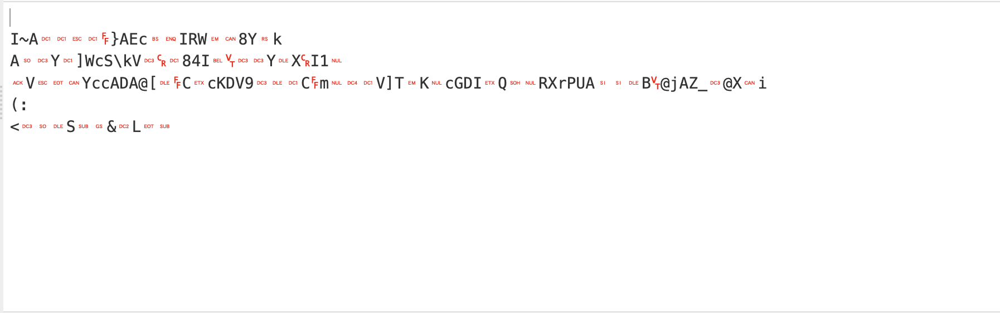
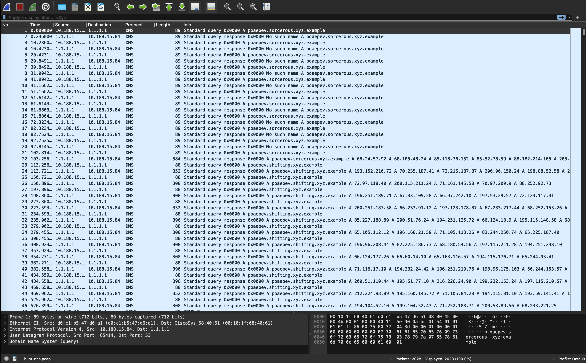

# T2D1: Master of your DNS

## Problem Description
TACKY TERMITE has sold access to a mysterious new threat actor, but thus far they've eluded detection.

Fortunately, the hunt team was able to find some unusual DNS activity (hunt-dns.pcap) from which the CSIRT team was able to isolate the host and pull the agent out of memory (sc.py).

Can you crack the the adversary's code and find out what they're hiding in plain sight?

### Resources
- [hunt-dns.pcap](resources/hunt-dns.pcap), SHA256: f739fbbe828d0487864a5d4bcfc5369ec8c97d47b1f8a2c9a4ca10c887a562ea
- [sc.py](resources/sc.py), SHA256: 8b98fb7424049d0641466feaded325b59f322cc18e4e54cac35d37c0f693d287

## Objectives
The flag will be embedded in the parameters of a URL: `https://<host>/<path>?wicys2024%5Bflag_here%5D`

In other words, you will eventually find a string containing a URL in this exact format.
There will be no need to generate your own URL or guess anything. It will be very obvious when you find it and you should be able to just copy/paste it.

## Approach and Solution
We immediately know this is immediately a Wireshark problem, from just looking at it. However, before we look at the `pcap` file, let's look at `sc.py`. 

### sc.py Analysis and Decoding
Near the very top, we see this line (formatted here for easier reading):

```python
cg={
    'i':'oaepev',
    'k':b'ciCada3301',
    'p':'sorcerous.xyz.example',
    's':10,
    'c':b'',
    'a':b'Ckl+QRERGxEMfUFFYwgFSVJXGRg4WR5rCkEOE1kRXVdjU1xrVhMNETg0SQcLExNZEFgNSTEACgZWGwQYWWNjQURBQFsQDEMDY0tEVjkTEBFDDG0AFBFWXVQZSwBjR0RJA1EBAFJYclBVQQ8PEEILQGpBWl8TQFgYaQooOgo8Ew4QUxodJhJMBBo='
    }
```
Hmm! cg['a'] looks pretty suspicious. We can pretty much immediately identify this as a Base64 encoded string (the `=` and the `+` give it away, plus only having alphanumeric characters). Decoding it from Base64 gives us this:


which is...not very helpful. Clearly there's another layer of encryption here.

Looking back at `sc.py`, we see this function:
```python
def dc(d,k):lk=len(k);return bytes(d^k[i%lk]for(i,d)in enumerate(d))
```
This basically tells us that the the plaintext is XOR'ed with the value assigned to `cg['k']`, a.k.a. the "key". XOR'ing the decoded Base64 text with the key, `ciCada3301` as UTF8 or Latin1, gives us this:

```python
i = up("<L", ia(ad))[0]
n = i >> 28
e = []
for j in range(4):
    sh = j * 7
    e.append((i & (0b1111111 << sh)) >> sh)
ck[n] = bytes(e)
```

This has some very annoying and unfun byte-shifting math and some weird loops, but the TLDR; of this function is that it takes an IP address, extracts 7-bit segments from it, and stores these segments in a dictionary `ck`. The key used to store the bytes object in the dictionary is determined by the upper 4 bits of the IP address.

If you don't quite understand it, don't worry. The computation is already done for you, so all you have to do later is shove it into a Python script.

What is relevant is the next part of `sc.py`:
```python
def do(cc):
	c=cc[0:1];a=cc[1:]
	match c:
		case b'r':cg['a']=be(dc(dc(bd(cg['a']),cg['k']),a));cg['k']=a
		case b'x':cu(cg['p'],cg['k'])
		case b'p':cg['p']=a
		case b'w':sp(int(a))
		case b'g':ri(a.decode(),cg['k'])
		case b'c':
			match a[0:1]:
				case b'c':cg['c']+=a[1:]
				case b'f':do(cg['c']+a[1:]);cg['c']=b''
```
We need to understand what happens at each 'r', 'x', etc. In a nutshell:

- `'r'`: Updates `cg['a']` and `cg['k']`.
- `'x'`: Executes `cu`.
- `'p'`: Updates the domain in `cg['p']`.
- `'w'`: Sleeps for the given duration.
- `'g'`: Executes `ri` with the given URL.
- `'c'`: Accumulates or processes commands.

Now we can finally look at the `.pcap` file in Wireshark.

### Wireshark Analysis
Opening up the file in Wireshark gives us this:

All in all, there are 2028 total packets captured--far too many to go through by hand. However, there is hope!

Looking back at `sc.py`, we can see that the domain specified in `cg['p]` is `sorcerous.xyz.example`. If we look at the PCAP file, we can see that the `sorcerous.xyz.example` domain is only there for the first 20 or so packets--then it transforms into `shifting.xyz.example`.

So what we do here is we actually just filter the PCAP file to display ONLY the responses from `sorcerous.xyz.example` (because our requests will not have the information we are looking for) and then export those packets as JSON. In this case, it's actually just one singular packet.

Inside that singular packet, we see that there are actually 11 IPs in the response. If we take all 11 IPs and process them using the function that we pulled from `sc.py`, we get this:

```
Resultant Dictionary: {5: b'B0da'}
Resultant Dictionary: {1: b'DRAA'}
Resultant Dictionary: {9: b'Ul1B'}
Resultant Dictionary: {3: b'Uh8Z'}
Resultant Dictionary: {6: b'XlZN'}
Resultant Dictionary: {4: b'MAkN'}
Resultant Dictionary: {8: b'SgRL'}
Resultant Dictionary: {0: b'EQRz'}
Resultant Dictionary: {7: b'ETob'}
Resultant Dictionary: {10: b'Dww='}
Resultant Dictionary: {2: b'QVAC'}
```
Oh, what's this? The keys are in numerical order? There's a `=` as the last character of the largest key? That's a huge hint that this is Base64 encoded and that we should rearrange the dictionaries in order of their key value. This gives us this:

```
[{0: b'EQRz'}, {1: b'DRAA'}, {2: b'QVAC'}, {3: b'Uh8Z'}, {4: b'MAkN'}, {5: b'B0da'}, {6: b'XlZN'}, {7: b'ETob'}, {8: b'SgRL'}, {9: b'Ul1B'}, {10: b'Dww='}]
```
which, when concatenated together, gives us `EQRzDRAAQVACUh8ZMAkNB0daXlZNETobSgRLUl1BDww=`.

Just like before, if we simply decode this from Base64, we don't get anything useful--just a bunch of random bytes. But if we XOR it with `ciCada3301`, we get the following:

`rm0ltarc2c|pshifting.xyz.example`

Now that's promising! What's even more promising is that this transforms into the `shifting.xyz.example` URL we see in the rest of the PCAP file.

Let's look at our `sc.py` file one more time. Recall the `do` function, specifically:
```python
def do(cc):
	c=cc[0:1];a=cc[1:]
	match c:
		case b'r':cg['a']=be(dc(dc(bd(cg['a']),cg['k']),a));cg['k']=a
		...
		case b'p':cg['p']=a
        ...
```

As we identified before, `'r'` updates `cg['a']` and `cg['k']` (the key), while `'p'` updates the domain in `cg['p']`. And if we look at what we got from the `sorcerous.xyz.example` URL, we can see that there is a `r` in front of `m0ltarc2c` and a `p` in front of `shifting.xyz.example`. So at this point, the key is no longer `ciCada3301`, but `m0ltarc2c`. Plus, now we need to look at IPs responding to `shifting.xyz.example`.

Now we repeat the steps from earlier. We filter Wireshark so we only see responses from `shifting.xyz.example`, and then export it to one big JSON file. Then we can write a Python script to parse it, ordering and decoding from Base64 and XOR'ing each response. We use `m0ltarc2c` as the key, and cross our fingers.

Our first naive attempt results in this:

```
rfghgqvhozd|w37|x
y!ajbw$au!?+z{
i"z|n|'i{+{m
h*w{yaj*|r:xe=4p0
j"kjlso'hg4smp3iop
l pmp`c(g`5;>xd
j7zfbmo2|c&,0x~
j/cspfa.jmd&ra
w!cxbkf5lk(g{km?uty
g>}miq}=2akgb?ulz
k1}mui`<hl0y|`1/>j
h4|y}z6{sw-oz
|.tagfn<{b:|??mh
r6lmut!wf=x$5mv
h!v`vbn+bi/c05tc
m ljifn"u~.}5?{p
m'sxk|e?~hd6jx
n t{ovc!ys+sy~7' p
}<bpfhu<uv;y30hn
e yvbei'd|3mvoq4bto
e+zuivg?dx$(6jz
s,ojsfv?}w74.jk
e(tyqeh/xb2'$ik
t<zaort'twu(ks
~&~js~m>xr4`pb 2(v
h!le{w<yt;gw :k0
z)qzc{q?ai#na|3-:x
...
...
```
Oh no! What went wrong?

Well, if we look closely at the output again, we can see that the first line begins with `r`. And we know that when we encounter an `r`, the key changes. So that means that once that first line is parsed, the key is no longer `m0ltarc2c`, but rather `fghgqvhozd`. So we need our Python script to take this into account.

After a little debugging and figuring out that these key changes could appear not just at the beginning of the lines, but the middle as well, I was able to script out something that actualy worked.

The final Python script I wrote to automate this decryption looks like this:

```python
import json
import base64
from struct import unpack
from socket import inet_aton

# This function is pulled pretty much directly from sc.py
def process_ip(ip_address):
    i = unpack("<L", inet_aton(ip_address))[0]
    n = i >> 28
    e = []
    for j in range(4):
        sh = j * 7
        e.append((i & (0b1111111 << sh)) >> sh)
    ck = {}
    ck[n] = bytes(e)

    return ck

# This function XORs each byte of data with the corresponding byte of the key, repeating as necessary
def xor_bytes(data, key):
    return bytes(d ^ key[i % len(key)] for i, d in enumerate(data))

def update_key_and_result(xor_result):
    xor_str = xor_result.decode('latin-1')
    new_key = None

    if xor_str.startswith('r'):
        new_key_start = xor_str[1:].split('|', 1)[0]
        new_key = new_key_start.encode('latin-1')
        xor_result = xor_result[len(new_key_start) + 2:]

    elif '|r' in xor_str:
        parts = xor_str.split('|r', 1)
        new_key_start = parts[1].split('|', 1)[0]
        new_key = new_key_start.encode('latin-1')
        xor_result = (parts[0] + '|' + parts[1][len(new_key_start) + 1:]).encode('latin-1')

    return xor_result, new_key

# This function processes every packet from the JSON file
def process_packet(packet, key):
    ip_addresses = []
    if "dns" in packet["_source"]["layers"]:
        answers = packet["_source"]["layers"]["dns"]["Answers"]
        for answer in answers.values():
            if "dns.a" in answer:
                ip_addresses.append(answer["dns.a"])

    if not ip_addresses:
        return None, key

    # Process all the IP addresses
    byte_sequences = []
    for ip_address in ip_addresses:
        result = process_ip(ip_address)
        byte_sequences.append(result)

    # Sort the list of dictionaries by key
    sorted_dicts = sorted(byte_sequences, key=lambda d: list(d.keys())[0])

    # Concatenate the values of the sorted dictionaries into one large string
    concatenated_string = ''.join(d[list(d.keys())[0]].decode('latin-1') for d in sorted_dicts)

    # Decode the concatenated string with Base64
    decoded_bytes = base64.b64decode(concatenated_string)

    # XOR the decoded bytes with the current key
    xor_result = xor_bytes(decoded_bytes, key)

    # Check and update the key if necessary
    xor_result, new_key = update_key_and_result(xor_result)

    if new_key:
        key = new_key

    return xor_result, key

def process_json_file(json_file, output_file):
    key = b"m0ltarc2c" 

    with open(json_file, "r") as f:
        packets = json.load(f)

    with open(output_file, "wb") as f:
        for packet in packets:
            result, key = process_packet(packet, key)
            if result:
                f.write(result + b"\n")

json_file = "pt2.json" 
output_file = "output1.txt"
process_json_file(json_file, output_file)

```

Finally, after all of our hard work, we are left with a clean `output1.txt` file:
```
w37|x
w47|x
w25|x
w11|x
w44|x
w29|x
w45|x
w28|x
w52|x
...
...
w151200|ccghttps://sc.xyz.ex
ccample/gate.php?wicys20|
cf24%5Bthis_is_our_year_2_rise%5D
```

`%5B` and `%5D` are the percent-encodings for the square brackets, `[` and `]`. So taking it all together, the final flag is:

`wicys2024[this_is_our_year_2_rise]`

## Rabbit Holes
Thankfully, I didn't fall too deep down the rabbit hole with this one. I always felt like I sort of knew where to look next to find the answer. The one small rabbit hole I did end up chasing was looking up what "moltarc" is. I got distracted by that for a good little while.