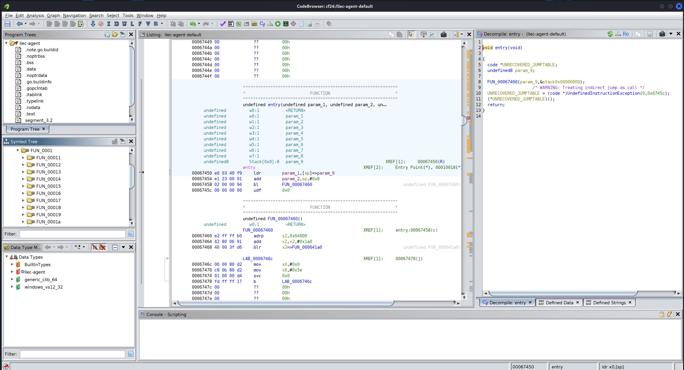
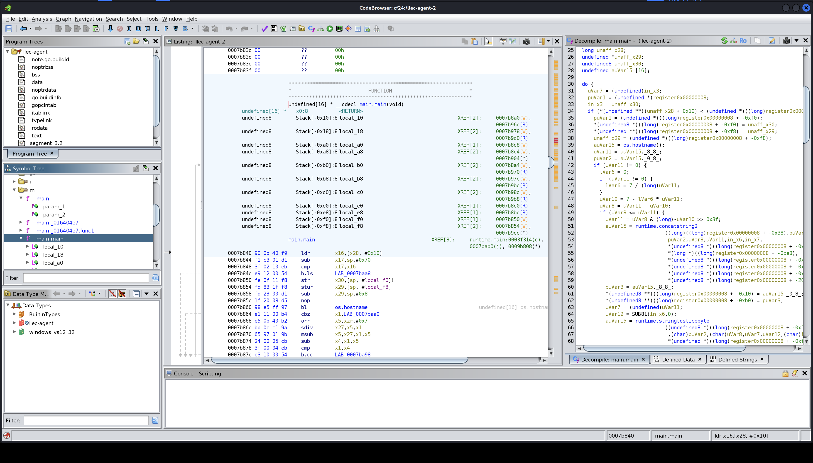
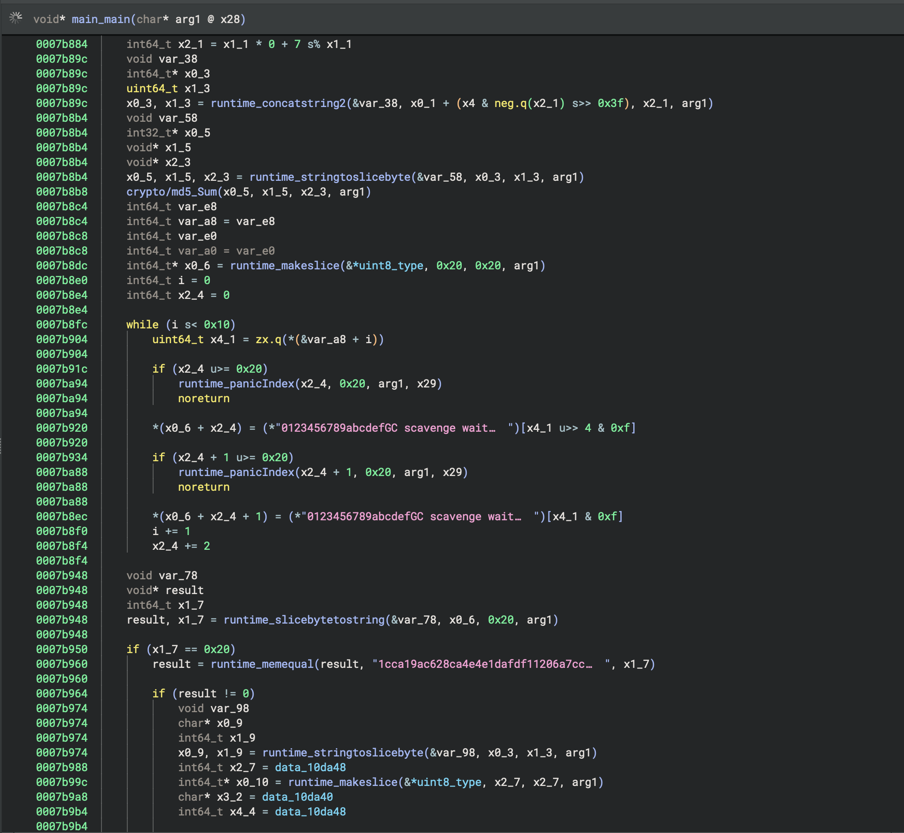
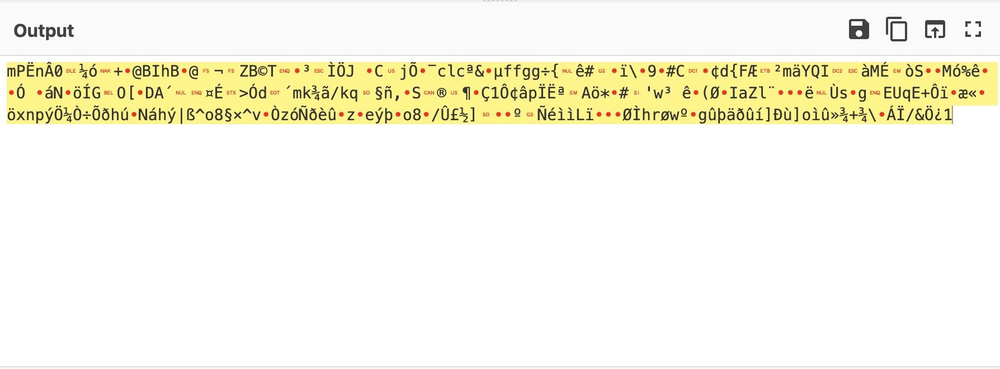
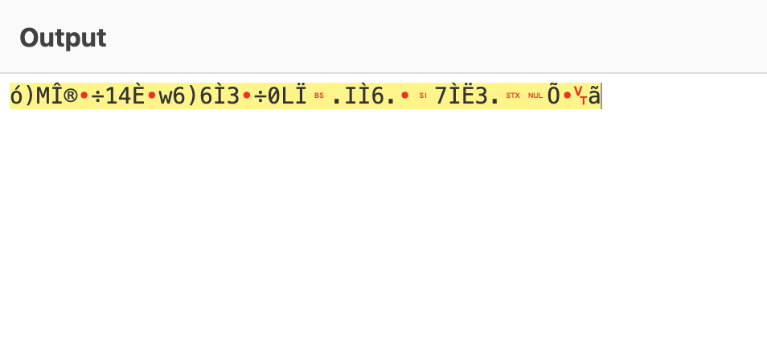

# T2D3: Reverse Roulette

## Problem Description
The IR team discovered a suspicious binary while investigating host LLEC-1701 on the Lucky Lion Casino's network. Your task is to reverse engineer the binary to uncover a hidden secret!

### Resources
- [llec-agent](resources/llec-agent)
- sha256: b83fd53231b091da8db47b8e7329a5a2de5e75ad281ed5c9656950176d2cffb3

## Objectives
- Analyze the binary and find the flag
- Flag Format `th1s_1s_4_s4mpl3_fl4g`

## Approach and Solution
Ooooh, this one upset me a little. I was so close to getting it, but just ran out of time at the very last step...anyways. Let's get into it.

### The llec-agent File
First, let's figure out what this file actually is. Running `file` on this binary gives us:

```
llec-agent: ELF 64-bit LSB executable, ARM aarch64, version 1 (SYSV), statically linked, Go BuildID=tYlDsiLxYd6HyxVOBig0/bDJJ4QmeYpZJdhZP786u/_DAgPqbuTIRD8R7Eyc2O/FDpZcnG10Z7IbFy-Z7-T, stripped
```

So we can see that this is a statically linked, stripped Go binary on an ARM64 system. This is truly what nightmares are made of.

A statically linked binary means that everything, *including outside library calls*, are all compiled together in the binary, which results in hellishly large binaries that have thousands of functions. A stripped binary means that all those function names, string identifiers, Go types, etc. are all *completely* stripped from the binary. And ARM64 just happens to be sort of a pain to work with.

Opening this file in Ghidra gives us approximately 8000+ functions and a bajillion strings. There's over a million lines in there, and it's all so obfuscated it's hard to tell where to begin. In fact, jumping to `entry` gives us this:

and trawling through the listing only gives us more and more undefined functions.

We have two options here: painstakingly trace every random function (remember, THOUSANDS OF THEM) or...find a way to restore some of the stripped information.

### Restoring the Go Binary
Luckily, there are some wonderful people out there who have looked very extensively into reverse engineering Go binaries. One of them happened to write a very useful article, along with supporting Github links, about such a thing.

https://cujo.com/blog/reverse-engineering-go-binaries-with-ghidra/

Using the methods and tools offered here, we can actually restore the function names using the `.gopclntab`. We're also able to retrieve and define dynamic strings, followed by static strings.

There's even a follow-up post to this post:

https://cujo.com/blog/reverse-engineering-go-binaries-with-ghidra-part-2-type-extraction-windows-pe-files-and-golang-versions/

With this, we can recover Go types as well. 

All we need to do is import the Python scripts into Ghidra scripts, and let it work its magic. Now when we look at the same file, we see this:

Even though this is still a little messy, it's already so much better!

### Tracing main.main and MD5 Hash
While `main` is the entry point, `main.main` is our bread and butter. At this point I switched to Binary Ninja, just due to the user interface being easier to use when tracing like this.



Tracing through the program, we see that it takes the hostname of the system, transforms it somehow with concatenation involved, then takes the MD5 hash of it and compares it to a value that is stored in the binary.

Honestly all I did for this part was write a Golang script that took the hostname (which we know to be `LLEC-1701` from the problem description) and had it concatenate against itself and calculate the hash until it found one that matched.

```golang
package main

import (
	"crypto/md5"
	"encoding/hex"
	"fmt"
)

// Constants from the binary
const (
	expectedHash  = "1cca19ac628ca4e4e1dafdf11206a7cc"
	constantBytes = "0123456789abcdef"
	dat0010da48   = 290 // Size in bytes, equivalent to 0x122. This is taken from the binary.
)

func checkHostname(hostname string) bool {
	fmt.Printf("Concatenated string: %s\n", hostname)

	md5Sum := md5.Sum([]byte(hostname))
	md5Hex := hex.EncodeToString(md5Sum[:])
	fmt.Printf("MD5 Hash: %s\n", md5Hex)

    // This whole loop is actually not necessary
    // I only have it in because the binary did and I was scared of messing it up
	var result string
	for i := 0; i < 16; i++ {
		highNibble := md5Sum[i] >> 4
		lowNibble := md5Sum[i] & 0x0F

		result += string(constantBytes[highNibble])
		result += string(constantBytes[lowNibble])
	}

	fmt.Printf("Processed result: %s\n", result)

	return result == expectedHash
}

func mainMain() {
	baseStr := "LLEC-1701"
	concatStr := baseStr + baseStr

	for i := 0; i < len(concatStr); i++ {
		for j := i + 1; j <= len(concatStr); j++ {
			substr := concatStr[i:j]
			fmt.Printf("Testing substring: %s\n", substr)
			if checkHostname(substr) {
				fmt.Printf("Matching hostname found: %s\n", substr)
				return
			}
		}
	}

	fmt.Println("No matching hostname found.")
}

func main() {
	mainMain()
}

```

This gave me the rotated hostname, `EC-1701LL`.

### Continuing to Trace main.main
Using Binary Ninja and tracing where the data leads, we get a few more leads:

- the data blocks are size 0x122, which is 290 bytes.
- There is more hidden data at 0x00104540
- That data likely goes on for 290 bytes.
- The data is XOR'ed with the character at a particular index of `EC-1701LL`. This index is calculated from the modulus of the current character location by the total length of the hostname.

When we go to 0x00104540 and get the 290 bytes of data there, we get the following hexdump:

```
00000000: 28 13 e6 5f f5 00 21 f0 bf 50 68 b2 71 75 79 59  (.._..!..Ph.quyY
00000010: 0e dc 05 5f 81 2d 6d 72 98 18 49 cc f0 36 fd e1  ..._.-mr..I..6..
00000020: 7a 11 dd 0f 5a 29 f8 4e 98 53 5d 2f e6 63 c4 98  z...Z).N.S]/.c..
00000030: 57 51 57 56 bb 37 45 a9 0e 2c a0 df 6d de 75 d5  WQWV.7E..,..m.u.
00000040: 60 6e 20 a3 92 55 37 0a 83 54 9f 5c d3 69 60 05  `n ..U7..T.\.i`.
00000050: 5e 5e a3 60 f8 2e c2 62 c3 de 08 b0 08 db ad b5  ^^.`...b........
00000060: e2 6c ce a4 0d b1 c7 fa 77 36 03 17 dd 07 6c 85  .l......w6....l.
00000070: 37 35 95 85 4e 7b 90 49 35 83 5d 5a f2 af 6a 28  75..N{.I5.]Z..j(
00000080: 5c 3f 90 c1 1d c4 1f 5d ed 32 87 ac f7 00 98 ee  \?.....].2......
00000090: a7 33 e2 fa 9d 29 70 ba 66 de 60 22 16 40 83 11  .3...)p.f.`".@..
000000a0: a6 33 6d 9b ac 78 56 6a 5d e4 c2 d2 d1 c6 31 ee  .3m..xVj].....1.
000000b0: 43 a4 2b 49 00 16 5c 74 1c e4 de ce aa ee cf db  C.+I..\t........
000000c0: 49 59 40 cc 9a f0 97 b4 f8 c1 5f ca ac 02 ad 2d  IY@......._....-
000000d0: be 51 ee 69 5f 09 eb 9b 1b 35 a3 e3 4d c3 e0 bc  .Q.i_....5..M...
000000e0: a4 be d9 57 a8 52 cd cf d5 23 7d 3c 02 ea 94 8d  ...W.R...#}<....
000000f0: 6c 42 d7 c8 f9 30 e0 de dc dd 00 a3 d8 d8 b6 e9  lB...0..........
00000100: fb 58 43 b4 3b ff da 4a ca c9 d4 c1 b7 a1 18 93  .XC.;..J........
00000110: d4 6c 58 dc ca f7 f2 6e fd 71 a3 f6 ff 1e 6a 9a  .lX....n.q....j.
00000120: fa 72                                            .r

```
Then we can extract all the hex codes. Now all we have to do is process it.

I wrote a Golang script to process the bytes:

```golang
package main

import (
	"fmt"
	"log"
	"os"
)

func main() {
	x0_10 := make([]byte, 290)    // Result array with length 290
	x3_2 := []byte{0x28, 0x13, 0xe6, 0x5f, 0xf5, 0x00, 0x21, 0xf0, 0xbf, 0x50, 0x68, 0xb2, 0x71, 0x75, 0x79, 0x59, 0x0e, 0xdc, 0x05, 0x5f, 0x81, 0x2d, 0x6d, 0x72, 0x98, 0x18, 0x49, 0xcc, 0xf0, 0x36, 0xfd, 0xe1, 0x7a, 0x11, 0xdd, 0x0f, 0x5a, 0x29, 0xf8, 0x4e, 0x98, 0x53, 0x5d, 0x2f, 0xe6, 0x63, 0xc4, 0x98, 0x57, 0x51, 0x57, 0x56, 0xbb, 0x37, 0x45, 0xa9, 0x0e, 0x2c, 0xa0, 0xdf, 0x6d, 0xde, 0x75, 0xd5, 0x60, 0x6e, 0x20, 0xa3, 0x92, 0x55, 0x37, 0x0a, 0x83, 0x54, 0x9f, 0x5c, 0xd3, 0x69, 0x60, 0x05, 0x5e, 0x5e, 0xa3, 0x60, 0xf8, 0x2e, 0xc2, 0x62, 0xc3, 0xde, 0x08, 0xb0, 0x08, 0xdb, 0xad, 0xb5, 0xe2, 0x6c, 0xce, 0xa4, 0x0d, 0xb1, 0xc7, 0xfa, 0x77, 0x36, 0x03, 0x17, 0xdd, 0x07, 0x6c, 0x85, 0x37, 0x35, 0x95, 0x85, 0x4e, 0x7b, 0x90, 0x49, 0x35, 0x83, 0x5d, 0x5a, 0xf2, 0xaf, 0x6a, 0x28, 0x5c, 0x3f, 0x90, 0xc1, 0x1d, 0xc4, 0x1f, 0x5d, 0xed, 0x32, 0x87, 0xac, 0xf7, 0x00, 0x98, 0xee, 0xa7, 0x33, 0xe2, 0xfa, 0x9d, 0x29, 0x70, 0xba, 0x66, 0xde, 0x60, 0x22, 0x16, 0x40, 0x83, 0x11, 0xa6, 0x33, 0x6d, 0x9b, 0xac, 0x78, 0x56, 0x6a, 0x5d, 0xe4, 0xc2, 0xd2, 0xd1, 0xc6, 0x31, 0xee, 0x43, 0xa4, 0x2b, 0x49, 0x00, 0x16, 0x5c, 0x74, 0x1c, 0xe4, 0xde, 0xce, 0xaa, 0xee, 0xcf, 0xdb, 0x49, 0x59, 0x40, 0xcc, 0x9a, 0xf0, 0x97, 0xb4, 0xf8, 0xc1, 0x5f, 0xca, 0xac, 0x02, 0xad, 0x2d, 0xbe, 0x51, 0xee, 0x69, 0x5f, 0x09, 0xeb, 0x9b, 0x1b, 0x35, 0xa3, 0xe3, 0x4d, 0xc3, 0xe0, 0xbc, 0xa4, 0xbe, 0xd9, 0x57, 0xa8, 0x52, 0xcd, 0xcf, 0xd5, 0x23, 0x7d, 0x3c, 0x02, 0xea, 0x94, 0x8d, 0x6c, 0x42, 0xd7, 0xc8, 0xf9, 0x30, 0xe0, 0xde, 0xdc, 0xdd, 0x00, 0xa3, 0xd8, 0xd8, 0xb6, 0xe9, 0xfb, 0x58, 0x43, 0xb4, 0x3b, 0xff, 0xda, 0x4a, 0xca, 0xc9, 0xd4, 0xc1, 0xb7, 0xa1, 0x18, 0x93, 0xd4, 0x6c, 0x58, 0xdc, 0xca, 0xf7, 0xf2, 0x6e, 0xfd, 0x71, 0xa3, 0xf6, 0xff, 0x1e, 0x6a, 0x9a, 0xfa, 0x72
	}
	x0_9 := []byte("EC-1701LL")  // The string 'EC-1701LL' needs to be treated as a byte array or else it won't work
	x1_9 := int64(len(x0_9))     // Length of x0_9
	x2_7 := int64(len(x3_2))     // Length of x3_2, which is 290
	x4_4 := int64(290)            // Length of x0_10 is 290

	file, err := os.Create("output.bin")
	if err != nil {
		log.Fatal(err)
	}
	defer file.Close()

	for i_1 := int64(0); i_1 < x4_4; i_1++ {

        // Calculate modulus
		x9_1 := i_1 % x1_9 

		// Perform the XOR operation and store the result in x0_10
		x0_10[i_1] = x3_2[i_1] ^ x0_9[x9_1]
	}

	_, err = file.Write(x0_10) 
	if err != nil {
		log.Fatal(err)
	}

	fmt.Printf("x0_10: %x\n", x0_10)
}

```

Running this, we get an output of:

`6d50cb6ec23010bcf3152b9f404249684290401cac1c5a42a9540589b31bccd64a2091431f6ad57faf636c63aa2687b566666767f77b00ea231d97ef5c92399023431194a2647b46c617b26de4595149121be04dc919f2538f924df325ea9a85d32082e14e9cf6cd47074f5b984441b40005a4c9023ed36404b46d6bbee32f6b710ea7f12c885318ae1fb69bc731d4a2e270cfcbaa1941f62a9b230f2777b320ea7f28d88149615a6ca88e9792eb00d973956705455571452bd4ef82e6ab8cf6786e70fdd6bcd2f7d5f068fa9d4ee168fd7cdf5e6f38a7d75e768ed27af3d1f0e8fb9a7a9965fdfe996f387f2fdba3bd5d0e9b8dba1dd1e9ecec4cef9d9b9bd8cc6872f877ba9967fbfee4f0fbed5dd0f95d6fecfbbbbe2bbe5c92c1cf2f26d6bf31`

Let's head over to CyberChef and stick this in as "From Hex":


Hmm. That doesn't seem quite right.

Looking back at the decompiled code, we see that there is raw inflate being called on the data (this is in main._016404e7). Perhaps we should inflate it?

```json
{
    "server": "magi.cicada",
    "port": 443,
    "useragent": "Mozilla/5.0 (Windows NT 10.0; Win64; x64) AppleWebKit/537.36 (KHTML, like Gecko) Chrome/127.0.0.0 Safari/537.36",
    "secret": "CQkJCSAgCQkgIAkgCSAgCSAJICAJCSAJCQkgIAkJCSAJIAkgCQkJIAkgICAJCSAgCQkJCSAJCQkgIAkJICAgCSAgCQkgCSAgCQkgIAkgICAJICAgCSAJCSAJCQkgCQkJICAJCSAJCSAgIAkgCSAgCSAgCQkgCQkgCQkgIAkJICAgIAkJICAJCQkgICAJICAgCQkJCSAJCQkgIAkJICAgICAJICAJCSAgCQkgIAkJCQkgICAgCSAgICAgCSAJCQkgIAkgIAkgIAkJCSAgCQkgICAgCQkgCQkgICAJIAkJCSAJICAgCQkJICAgICAJCQkJICAJCSAJCQkJCSAgCQkgIAkJICAJIAkJICAJCSAgCQkgIAkgCQkJICAgICAgIAkgICAgICAgICAJCSAJIAkgCQkgICAJCQkJICAgIAkgCQkJCQkgICAJCQ=="
}
```
Well! That certainly looks correct!

### The Final Decryption
The secret is clearly Base64 encoded, which we can tell by the `=` and the use of only alphanumeric characters. But decoding it from Base64 only gives us...white space?

Upon further decoding, we recognize that it is in fact a series of tabs and spaces. Specifically, it decodes into this:

`TTTTSSTTSSTSTSSTSTSSTTSTTTSSTTTSTSTSTTTSTSSSTTSSTTTTSTTTSSTTSSSTSSTTSTSSTTSSTSSSTSSSTSTTSTTTSTTTSSTTSTTSSSTSTSSTSSTTSTTSTTSSTTSSSSTTSSTTTSSSTSSSTTTTSTTTSSTTSSSSSTSSTTSSTTSSTTTTSSSSTSSSSSTSTTTSSTSSTSSTTTSSTTSSSSTTSTTSSSTSTTTSTSSSTTTSSSSSTTTTSSTTSTTTTTSSTTSSTTSSTSTTSSTTSSTTSSTSTTTSSSSSSSTSSSSSSSSSTTSTSTSTTSSSTTTTSSSSTSTTTTTSSSTT`

where `T` is a tab and `S` is a space.

This is pretty binary...right?

Speaking of binary, what if we turn the T's to 1's and S's to 0's? Then we can stick in CyberChef and use the "From Binary" option.


That still doesn't look quite right.

We had to inflate the hex earlier, right? So what if we have to do it again here?

If we inflate this result, then we finally get the flag:

`Lucky_L10n_C4s1n0_H1ghStak3s_W1nn3r`

And that is a wrap!

## Rabbit Holes
### The Unicode Debacle
### Is this concatenation or rotation?
### Not the Language Whitespace
### Strings.