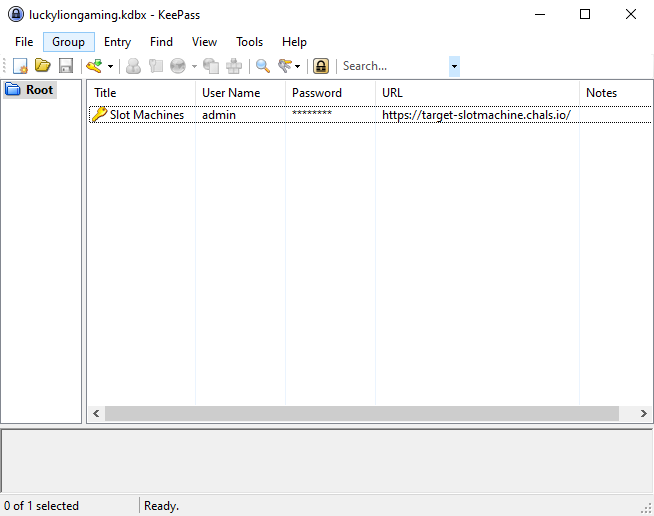
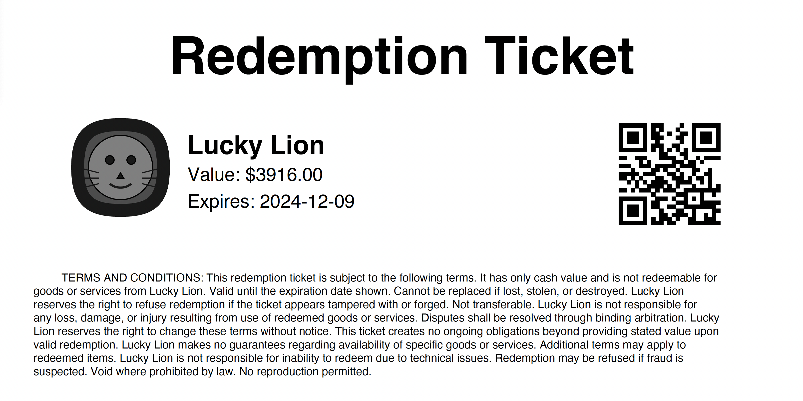

# T2O3: Reel Money

## Problem Description
Lucky you! With your insider access, you've been able to obtain a file that could lead to more interesting places.

But, is it enough to steal a Lucky Lion Redemption Ticket with a value of at least $1,000.00?

Keep in mind, the casino employees are always on the alert for odd behavior, and could try to thwart you.

The flag has the format wicys2024[NNNN.NN:XXXXXXXXXXX]. Don't waste time trying to tamper or guess the flag itself.

### Resources
- [luckyliongaming.kdbx](resources/luckyliongaming.kdbx)

## Objectives
- Steal a Lucky Lion Redemption Ticket with a value of at least $1,000.00

## Approach and Solution
Banging. My. Head.

I spent BY FAR the most time on this problem. Like I think...nearly two weeks? There were just specific things about this problem that sent me down insanely deep rabbit holes. I definitely way, way, WAY overcomplicated this problem. And when I say "overcomplicated," I mean 182 files. **EIGHTEEN** different Python scripts. Go scripts, for whatever reason (???). Hundreds of lines of notes. One file with "machine cookies"...except there were 25,000 machine cookies in there. But...we'll get into that.

### The .kdbx File
First, let's look at the file that we are given. This is a .kdbx file, which, upon a quick Google search, reveals that it is a KeePass database. KeePass happens to be a password manager, so we can assume that if we are able to crack this, we may get a useful password out of it.

To crack the .kdbx file, all we have to do is run John the Ripper on it with the rockyou.txt wordlist. Within just a few moments, we have the password--`jackpot`.

Entering in the password gives us this:



The password, once viewed, turns out to be ```m#C5v5qdo`47```. There is also a link that goes to https://target-slotmachine.chals.io. Going to this site, we can log into it with the the usernamed `admin`  and the password we just found. This brings us to the source of all our and suffering:


### Investigating target-slotmachines.chals.io
If we open developer tools and look at the network tab, we can see that this site is constantly making requests to the backend, perhaps every few seconds.

We are also able to view the JavaScript for this page:
<details>
    <summary>JavaScript Code</summary>
    let updateInterval;

    // Function to show error messages
    function showError(message) {
        const errorElement = document.getElementById('error');
        errorElement.textContent = message;
        errorElement.style.display = 'block';
    }

    // Function to hide error messages
    function hideError() {
        const errorElement = document.getElementById('error');
        errorElement.style.display = 'none';
    }

    // Function to fetch and display the service status
    async function fetchServiceStatus() {
        try {
            const response = await fetch('/api/machine');
            if (!response.ok) {
                throw new Error('Failed to fetch machines');
            }
            const machine = await response.json();
            if (!machine) {
                throw new Error(`Machine not found`);
            }

            const statusElement = document.getElementById('service-status');
            const enableButton = document.getElementById('enable-service');
            const disableButton = document.getElementById('disable-service');
            const span = document.getElementById('machine_id');
            span.textContent = machine['machine_id'];

            if (machine.in_service) {
                statusElement.textContent = 'IN_SERVICE';
                statusElement.className = 'service-status in-service';
                enableButton.disabled = true;
                disableButton.disabled = false;
            } else {
                statusElement.textContent = 'OUT_OF_SERVICE';
                statusElement.className = 'service-status out-of-service';
                enableButton.disabled = false;
                disableButton.disabled = true;
            }

            const configButtons = ['backup-config', 'restore-config', 'reset-config'];
            configButtons.forEach(id => {
                document.getElementById(id).disabled = !machine.in_service;
            });
        } catch (error) {
            console.error('Error fetching service status:', error);
            showError(`Failed to fetch service status: ${error.message}`);
        }
    }

    // Function to fetch and display totals
    async function fetchTotals() {
        try {
            const response = await fetch(`/api/totals`);
            if (!response.ok) {
                throw new Error('Failed to fetch totals');
            }
            const data = await response.json();
            const totalsElement = document.getElementById('totals');
            totalsElement.innerHTML = `
                <p>Total Pulls: ${data.total_pulls}</p>
                <p>Total Wager: $${data.total_wager.toFixed(2)}</p>
                <p>Total Payout: $${data.total_payout.toFixed(2)}</p>
                <p>House Edge: ${data.house_edge.toFixed(2)}%</p>
                <p>Total Credits: $${data.total_credits.toFixed(2)}</p>
                <p>Total Cash Out: $${data.total_cash_out.toFixed(2)}</p>
                <p>House Take: $${data.house_take.toFixed(2)}</p>
            `;
        } catch (error) {
            console.error('Error fetching totals:', error);
            showError('Failed to fetch totals');
        }
    }

    // Function to fetch and display recent pulls
    async function fetchRecentPulls() {
        try {
            const response = await fetch(`/api/pulls?limit=10`);
            if (!response.ok) {
                throw new Error('Failed to fetch recent pulls');
            }
            const data = await response.json();
            const tbody = document.querySelector('#recent-play tbody');
            tbody.innerHTML = '';
            data.pulls.forEach(pull => {
                const row = tbody.insertRow();
                row.innerHTML = `
                    <td>${pull.id}</td>
                    <td>${pull.timestamp}</td>
                    <td>${pull.result}</td>
                    <td>${pull.wager}</td>
                    <td>${pull.payout}</td>
                    <td>${pull.credit}</td>
                    <td>${pull.cash_out}</td>
                    <td>${pull.credit_balance}</td>
                    <td>${pull.event_type}</td>
                `;
            });
        } catch (error) {
            console.error('Error fetching recent pulls:', error);
            showError('Failed to fetch recent pulls');
        }
    }

    // Function to fetch and display print log
    async function fetchPrintLog() {
        try {
            const response = await fetch(`/api/printed_tickets?limit=10`);
            if (!response.ok) {
                throw new Error('Failed to fetch print log');
            }
            const data = await response.json();
            const tbody = document.querySelector('#print-log tbody');
            tbody.innerHTML = '';
            data.printed_tickets.forEach(ticket => {
                const row = tbody.insertRow();
                row.innerHTML = `
                    <td>${ticket.timestamp}</td>
                    <td>${ticket.ticket_uuid}</td>
                    <td>$${ticket.amount.toFixed(2)}</td>
                `;
            });
        } catch (error) {
            console.error('Error fetching print log:', error);
            showError('Failed to fetch print log');
        }
    }

    // Function to fetch and display the current configuration
    async function fetchAndDisplayConfig() {
        try {
            const response = await fetch(`/api/config`);
            if (!response.ok) {
                throw new Error('Failed to fetch configuration');
            }
            const data = await response.json();

            // Display the configuration
            const configContent = document.getElementById('config-content');
            configContent.textContent = JSON.stringify(data.config, null, 2);
        } catch (error) {
            console.error('Error fetching configuration:', error);
            showError('Failed to fetch configuration');
        }
    }

    // Function to update the dashboard
    async function updateDashboard() {
        hideError();

        const updateFunctions = [
            { func: fetchServiceStatus, errorMsg: 'Failed to update service status', clearFunc: clearServiceStatus },
            { func: fetchTotals, errorMsg: 'Failed to update totals', clearFunc: clearTotals },
            { func: fetchRecentPulls, errorMsg: 'Failed to update recent pulls', clearFunc: clearRecentPulls },
            { func: fetchPrintLog, errorMsg: 'Failed to update print log', clearFunc: clearPrintLog },
            { func: fetchAndDisplayConfig, errorMsg: 'Failed to update configuration', clearFunc: clearConfig }
        ];

        for (const { func, errorMsg, clearFunc } of updateFunctions) {
            try {
                await func();
            } catch (error) {
                console.error(`Error: ${errorMsg}`, error);
                showError(`${errorMsg}. Clearing this section's data.`);
                clearFunc();
            }
        }
    }

    function clearServiceStatus() {
        document.getElementById('machine_id').textContent = '';
        const statusElement = document.getElementById('service-status');
        statusElement.textContent = 'Status Unknown';
        statusElement.className = 'service-status';
    }

    function clearTotals() {
        document.getElementById('totals').innerHTML = '<p>Totals data unavailable</p>';
    }

    function clearRecentPulls() {
        document.querySelector('#recent-play tbody').innerHTML = '<tr><td colspan="9">Recent play data unavailable</td></tr>';
    }

    function clearPrintLog() {
        document.querySelector('#print-log tbody').innerHTML = '<tr><td colspan="5">Print log data unavailable</td></tr>';
    }

    function clearConfig() {
        document.getElementById('config-content').textContent = 'Configuration data unavailable';
    }

    // Function to start auto-refresh
    function startAutoRefresh(machineId) {
        if (updateInterval) {
            clearInterval(updateInterval);
        }
        updateInterval = setInterval(() => updateDashboard(), 5000);
    }

    function toggleService(setInService) {
        const endpoint = setInService ? 'in_service' : 'out_of_service';
        fetch(`/api/machine/${endpoint}`, {
            method: 'GET'
        })
        .then(response => {
            if (!response.ok) {
                throw new Error('Network response was not ok');
            }
            return response.json();
        })
        .then(data => {
            console.log('Service state updated:', data);
            updateDashboard();
        })
        .catch(error => {
            console.error('Error updating service state:', error);
            showError('Failed to update service state. Please try again.');
        });
    }

    // Update event listeners for enable and disable buttons
    document.getElementById('enable-service').addEventListener('click', () => {
        toggleService(true);
    });

    document.getElementById('disable-service').addEventListener('click', () => {
        toggleService(false);
    });

    // Event listener for backup …
</details>

So from this code, along with poking around the developer tools for a little while, we are able to gather several things:
- There are several APIs which are called every 5 seconds or so
- Nothing works unless you toggle the machine on
- The machine is identified by a UUID, which is set as the cookie for the site
- With the default configuration, it is nearly impossible (if not outright impossible) to get a ticket  over $1000.
- The configuration can be "restored"--in other words, we can change the configuration to be whatever we like...as  long as it passes the filters

Speaking of the APIs, if you did some fuzzing and directory searching (like I did), you might have come across the API docs at `/docs` and `/redoc`. Sepcifically, the `/docs` URL lets you test and interact with all the APIs as you wish. It's great to play around with to help understand exactly what is happening, but it's not strictly necessary to solve the challenge (though it is helpful).

These docs are autogenerated, but understanding them helps understand how we need to attack the configuration and change it.

### Changing the Configuration
In order to change the configuration, we must understand it first.

Our next step, therefore, is to download the configuration in order to analyze it, which we can do by just clicking the `Backup Configuration` button. This downloads a file called `slot_machine.backup`. If we just directly click into the file, we get...a whole lot of random, unreadable bytes. It's not very useful. But if we run `file` on it, we discover it is compressed with `zstd`. Thus, we can just use `unzstd` to decompress it. When we do that, we get this:

```json
{
    "payout_multipliers": {
        "\ud83c\udf52": 1, 
        "\ud83c\udf4b": 3, 
        "\ud83c\udf4a": 4, 
        "\ud83c\udf49": 7, 
        "\ud83c\udf47": 13, 
        "\ud83c\udf53": 20, 
        "\ud83d\udc8e": 67
        }, 
    "symbol_weights": {
        "\ud83c\udf52": 20, 
        "\ud83c\udf4b": 16, 
        "\ud83c\udf4a": 13, 
        "\ud83c\udf49": 10, 
        "\ud83c\udf47": 8, 
        "\ud83c\udf53": 5, 
        "\ud83d\udc8e": 3
        }, 
    "~HMAC": "586d5b84466bacb35880db14a0f7ea8e"
}
```

We can see that the emojis are encoded with their Unicode equivalent, and that there is an HMAC at the end. An HMAC (or Hash-based Message Authentication Code) is a cryptographic technique used to ensure the integrity and authenticity of a message. It combines a cryptographic hash function (such as SHA-256 or MD5) with a secret key.

In our case, we can see that the HMAC is 32 characters long--that is, it corresponds exactly to the length of a MD5 hash. So we know that the HMAC function is performed on a MD5 hash of the JSON data.

The next step, then, is to determine the secret that the HMAC function is using. There are several ways to go about this. In my case, I tried using wordlists first, running it against many passwords. When that failed, I used `hashcat` to brute-force secrets of length 1-5.

Once `hashcat` determined that there was no secret of length 1-5, I wrote a custom Golang script to check for secrets of length 6. I did this with a custom script in order to narrow down the search space. For example, I first tried with just the lowercase alphabet. If this failed, I would include the uppercase alphabet while excluding all cached attempts, then include numbers, then special characters, and so on.

```golang
package main

import (
	"crypto/hmac"
	"crypto/md5"
	"encoding/hex"
	"fmt"
	"os"
)

var originalMsg = []byte(`{"payout_multipliers": {"\ud83c\udf52": 1, "\ud83c\udf4b": 3, "\ud83c\udf4a": 4, "\ud83c\udf49": 7, "\ud83c\udf47": 13, "\ud83c\udf53": 20, "\ud83d\udc8e": 67}, "symbol_weights": {"\ud83c\udf52": 20, "\ud83c\udf4b": 16, "\ud83c\udf4a": 13, "\ud83c\udf49": 10, "\ud83c\udf47": 8, "\ud83c\udf53": 5, "\ud83d\udc8e": 3}}`)

var originalHMACMD5Hash, _ = hex.DecodeString("586d5b84466bacb35880db14a0f7ea8e")

// Character set and key length
var charset = []byte("abcdefghijklmnopqrstuvwxyz")
var keyLength = 6

func verifyHMACMD5(originalMsg, calculatedHMAC, key []byte) bool {
	hash := hmac.New(md5.New, key)
	hash.Write(originalMsg)
	calculatedSignature := hash.Sum(nil)

	return hmac.Equal(calculatedSignature, calculatedHMAC)
}

func generateKey(index int, charset []byte, keyLength int) []byte {
	key := make([]byte, keyLength)
	for i := 0; i < keyLength; i++ {
		key[keyLength-i-1] = charset[index%len(charset)]
		index /= len(charset)
	}
	return key
}

func main() {
	totalKeys := 1
	for i := 0; i < keyLength; i++ {
		totalKeys *= len(charset)
	}

	for i := 0; i < totalKeys; i++ {
		key := generateKey(i, charset, keyLength)

		if verifyHMACMD5(originalMsg, originalHMACMD5Hash, key) {
			fmt.Printf("Key found: %s\n", key)
			os.Exit(0)
		}
	}

	fmt.Println("Key not found within the provided charset and length.")
}

```

Fortunately for me, I was able to brute force the secret key with just the lowercase alphabet--`felipe`.

From here, all I needed to to was change the configuration as I liked and feed it through a HMAC generator to generate the correct HMAC, append the HMAC to the JSON, then compress it with `zstd` to prepare it for upload. To do this, I wrote a Python script to get the HMAC, and the manually appended the rest (this was mostly because in one of my rabbit holes, I was playing around with structure...).

```python
import hashlib
import hmac

# The message and key, both treated as raw byte strings
message = b'{"payout_multipliers": {"\ud83c\udf52": 1, "\ud83c\udf4b": 3, "\ud83c\udf4a": 4, "\ud83c\udf49": 7, "\ud83c\udf47": 13, "\ud83c\udf53": 20, "\ud83d\udc8e": 67}, "symbol_weights": {"\ud83c\udf52": 20, "\ud83c\udf4b": 16, "\ud83c\udf4a": 13, "\ud83c\udf49": 10, "\ud83c\udf47": 8, "\ud83c\udf53": 5, "\ud83d\udc8e": 3}}'
key = b'felipe'

def generate_hmac_md5(message, key):
    """Generates the HMAC-MD5 hash for the given message and key."""
    
    hash_obj = hmac.new(key, message, hashlib.md5)
    
    hmac_md5 = hash_obj.hexdigest().encode('ascii')
    
    print(f"HMAC-MD5: {hmac_md5.decode('ascii')}")

generate_hmac_md5(message, key)

```

Now we have successfully update the configuration, and all we have to do is wait...

### The Spooler
Eventually, after some time of waiting, restarting the machines (thank you Target team), and switching between a house edge configuration and a configuration that will give us a high-value ticket, we get a ticket over $1000! Hurrah!

Looking at the developer tools again, we can see something like this as a network response:

```json
{
    "printed_tickets": [
        {
            "timestamp": "2024-09-06T07:17:20",
            "ticket_uuid": "6bcdfb51-c938-4f68-853c-b4df218fe221",
            "amount": 2899.0,
            "file_path": "spooler/6bcdfb51-c938-4f68-853c-b4df218fe221.pdf"
        },
        {
            "timestamp": "2024-09-06T07:15:48",
            "ticket_uuid": "3b88b5c6-987f-4071-b637-dd92ac162669",
            "amount": 310.0,
            "file_path": "spooler/3b88b5c6-987f-4071-b637-dd92ac162669.pdf"
        }
    ]
}
```

Whoa! Now that seems promising! Look at that file path!

But going to that spooler returns...nothing? We only get a 404-File Not Found error.

Upon further investigation, we notice that the spooler is a printer spooler--that is, it is a print queue, and therefore most likely temporary. We have to act faster.

Let's generate another ticket:

```json
{
    "printed_tickets": [
        {
            "timestamp": "2024-09-07T03:58:59",
            "ticket_uuid": "6bfad0f5-1135-4820-a482-adc5c6e190c8",
            "amount": 3916.0,
            "file_path": "spooler/6bfad0f5-1135-4820-a482-adc5c6e190c8.pdf"
        }
    ]
}
```
and this time, we'll go the the spooler link as quickly as we can. This time, we get the PDF, which has this:



And if we scan the QR code, we finally get the flag:

`wicys2024[3916.00:XCEKODBNAIO]`

What's so clever about this challenge is I believe every flag is actually unique, which is very cool!

## Rabbit Holes

### The Nmap Scans

### The Nmap Scans Aftermath (or, what I did before I realized that was not a Target IP)

#### The Reel Exploit (Phishing and AD)

#### SSLstrip and Other Fun Activities

#### RCE

#### What Do You Mean, The Email Logins Are In Plaintext

#### Not a Target CTF

### Fuzzing, Gobuster, and Feroxbuster

### The /admin URL

### Being Too Smart About HMACs

### Steganography

### Timing Attack

### Web Workers and Blobs

### XSS

### Length Extension Attack

### John the Ripper Hates Me

### The /static/enigmo URL

### JSON Injection and IDOR

### FastAPI Deep Dive

### Symbolic Links

### Local File Inclusion