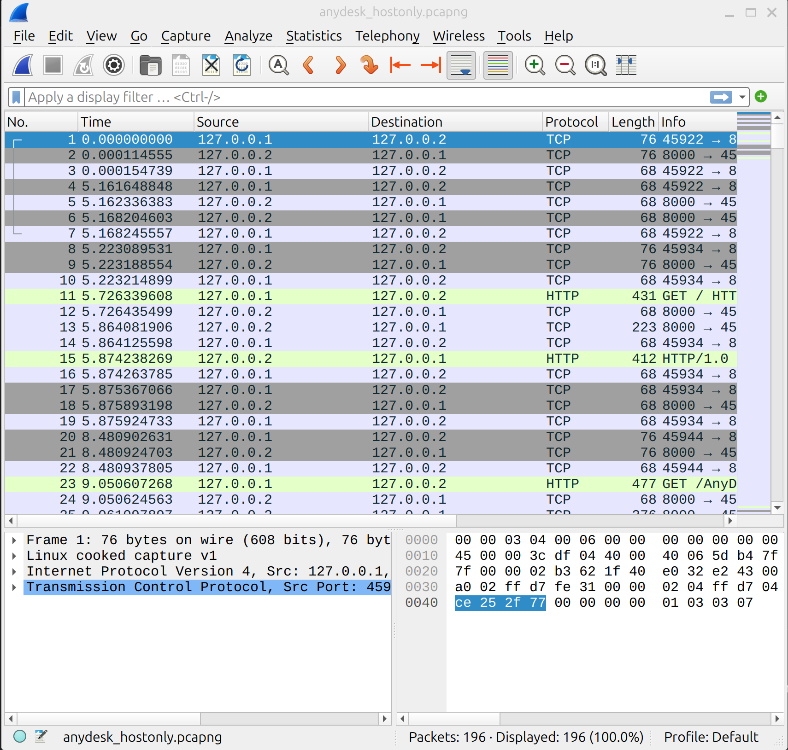
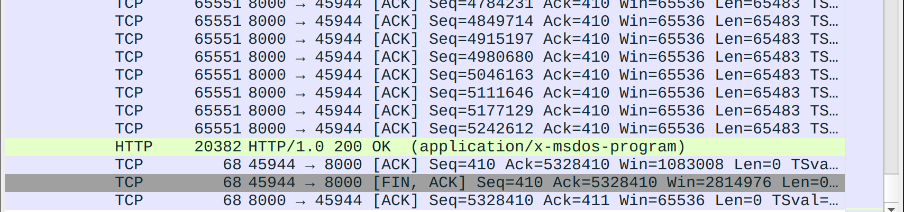
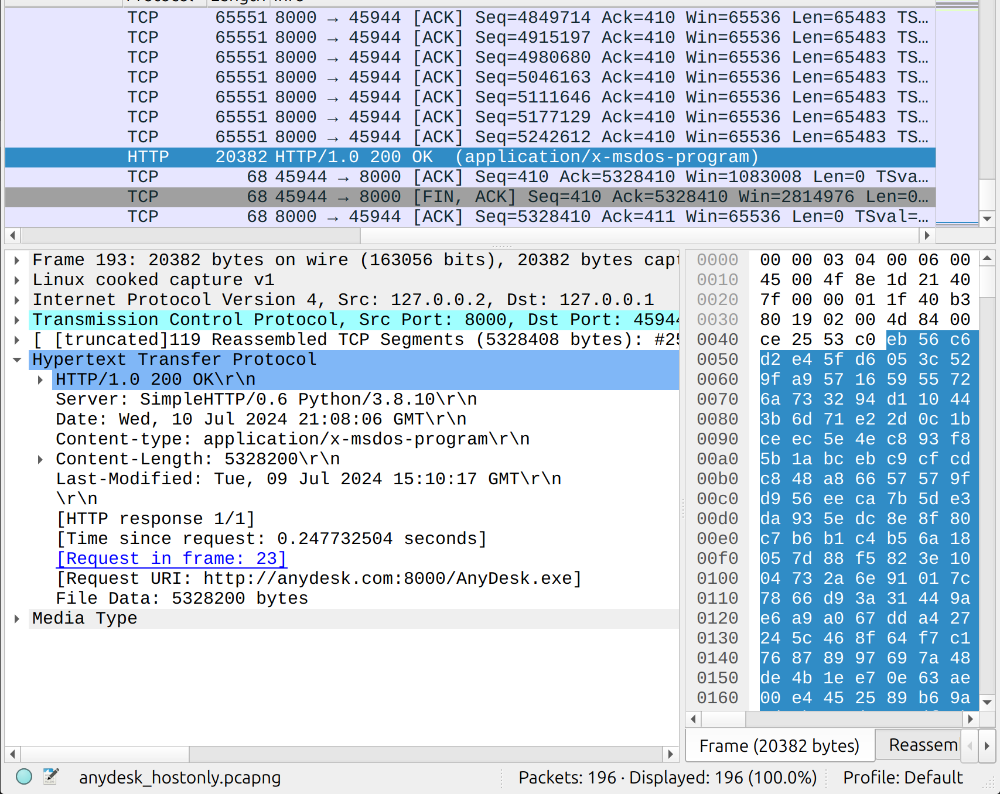

# D6: PCAP Analysis

## Problem Description
You have been given a [PCAP file](resources/anydesk_hostonly.pcapng) of Bob's browsing traffic concerning a known Remote Access tool. You'll need to examine the PCAP to determine which tool was downloaded on the host and where it came from.

General Questions:

- Did the user have any suspicious downloads?
- What is the purpose of the executable?
- What was the domain the executable was downloaded from?
- What is the source port?

## Objectives
Determine if there was a suspicious download, what it was, and where it came from. Identify the full request URI that the executable was downloaded from.

## Approach and Solution
This is a pretty straightforward Wireshark problem. I'm writing this up mostly for the benefit of people who may not be familiar with the tool.

When we first open the given PCAP file with Wireshark, we see this:

We are specifically concerned with anything that is highlighted in green. In Wireshark, a green highlight means that the packet is part of a successful TCP session--in other words, these are the packets that will contain details about the downloads, should there be any.

Scrolling through the PCAP file and quickly scanning over the green highlights, we find something of note:

This is the packet we are looking for! We can clearly see that it is marked as an application, which fits the criteria.

Clicking on the packet and then opening the Hypertext Transfer Protocol shows us this:

This gives us the full request URI for the executable.
`http://anydesk.com:8000/AnyDesk.exe`