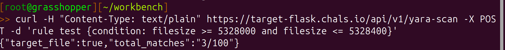

# D8: YARA Analysis

## Problem Description
You and the rest of The Lucky Lion's IR team are deep in your investigation, digging into hosts with signs of unusual activity. While pulling artifacts from host A (WDIGCVY2S), you identified the tool download utilized by the threat actor. You capture the file and submit it to Strelka, a real-time, container-based file scanning system used for threat hunting, threat detection, and incident response. The [strelka.json](resources/strelka.json) results identified the file as AnyDesk and you determined the file was downloaded and utilized by the threat actor.

## Objectives
Create a YARA rule that will detect the target file. The target file has similar meta information identified in strelka.json. There are a total of 100 files, only one is the target file.

## Approach and Solution
This was by far the hardest defensive challenge of this CTF, made difficult not only by the file format and information format, but by just the specific knowledge necessary in order to pare down the files.

We are given this command in order to interact and search for the target file:

`curl -H "Content-Type: text/plain" https://target-flask.chals.io/api/v1/yara-scan -X POST -d 'rule test {condition: true}'`

which is a POST request sent with curl to the challenge domain. We edit the `rule` section of the command in order to send the YARA rule.

Running the command as given, with no modifications, gives us this:

From this, we can see that the server will return us two key-value pairs:
- Whether or not the target value is in the set of files returned by the search
- The number of total matches given our rule

We also see from the objective statement that the target file has similar (but not identical!) meta information as the file analyzed by strelka.json.

Here is where we get to the fun (or not-so-fun part): going through the strelka.json file to see what we can use to match.

My first try was with the hashes--after all, if we can just search with the hashes, then it would be super easy! Alas, it was not so. Since the strelka.json file is *not* identical, the hashes are also different. So using hashes for this problem is more or less useless.

I tried to do some string matching, but due to the nature of terminal commands and the lack of formatting, I could never really get more than one string matching pattern to work.

I also looked at the header (which returned 100/100 matches) and the footer (which returned something like 30/100 matches). Although the footer seemed promising at first, I recognized that I could not find any other determining information using the footer, so I moved on to other methods.

I probably went chasing down random rabbit holes that ended up being incorrect for 4-5 hours. Towards the end of that, I was scouring the `strelka.json` file end to end for any hint of what could be the right approach.

Where the secret to this problem actually lies in the is the "pe" section of the `strelka.json` file--in other words, information found in the PE header. The PE header contains meta information about the file--exactly what we are looking for.

Here is where it really gets tricky: the file we are looking for is only similar to the [strelka.json] file, NOT identical. So if we search for just the given meta information, it will not return anything. However, if we search for files with meta values *around* the same value as the [strelka.json] files, we actually begin getting returns.

For example, the filesize denoted in [strelka.json] is 5328201. If we search for this exact size on the server with curl, we get:

No matches at all.

However, if we search for filesize within a range of 5328201 +/- 200, instead we get:

Whoa! That's way better! 3/100, AND the target file is in there!
Now I just do a quick manual binary search, and in no time, I find the exact filesize: 5328200. Searching for exactly this value also yields 3/100 results, so we need some other filters in order to get that target file.

I use the same method to get the checksum, the PE overlay size, and the PE entry point for the target file. Altogether, the command looks like this:

`curl -H "Content-Type: text/plain" https://target-flask.chals.io/api/v1/yara-scan -X POST -d 'import "pe" rule Detect_AnyDesk { condition: filesize == 5328200 and pe.overlay.size == 20808 and pe.entry_point == 4325 and pe.checksum == 5359632}'`

Sending that to the server gives us this:

...which is the flag:

`{"flag":"y3t_an0th3r_r3curs1v3_acr0nym"}`
