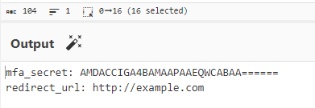

# O3: Constructing Your Phish

## Problem Description
You have your credential harvester ready to go, but how exactly are you going to trick your victims into visiting the site hosting it? Much like the harvester, your "hook" will work best if it mimicks something legitimate that the victim is expecting to see.

While researching The Lucky Lion leading in preparation for this attack, you had discovered that the casino uses multi-factor authentication for employees. Specifically, you learned that they use Squishy Security, a budget security solution notorious for a host of backdoors. Employees need to scan a QR code to sign up with the service on their company phones, so perhaps we can phish them to click on our harvester? Given [this MFA onboarding email](img/o3-1.png), can you engineer an attack QR code to capitalize on Squishy Security's lackluster control mechanisms?

## Objectives
- Crack the MFA QR code's security scheme
- Submit your own malicious QR code that is the same as the example, except it would redirect to http://wood-chewers.trees instead of the normal casino sign-in. NOTE: if the example QR's text had any special formatting/encryption applied, so should your submitted QR!

## Approach and Solution
The first thing we see when we look at the example onboarding email is the QR code. If we scan it, we get this:

`XVFQZkFVUUBVQwsZc312c3N0eH5zBHBzfXZwaXNxd2NndHB7c3EPDw0KDAQ4QldWWUVUWkZvR0BcDRFRRkRCCB8YVEFTXUJeVRlSVl8=`

...which is pretty much meaningless gibberish. However, we can also tell that this is Base64 pretty easily. Decoding from Base64 gives us this:

`]QPfAUQ@UCs}vsstx~sps}vpisqwcgtp{sq8BWVYETZFoG@\QFDBTAS]B^URV_`

...which is still pretty meaningless. It's clear that there is another layer of encryption on top of that.

However, we do get a hint at the encryption type from the email. Squishy Security has parternered with "Xpert Online Resilience"...or, in other words, XOR. Thus, we know this is an XOR encryption scheme.

Here are the 2 characteristics about the XOR encryption scheme that make this problem possible:
1) If you XOR something that is already XOR'ed, you get back the original value. In other words, if you XOR the ciphertext with the key, you get the plaintext. But if you XOR the ciphertext with the plaintext, you also get the key.
2) XOR encryption repeats--that is, if the message is longer than the key, it simply repeats the key over and over until we get the end of the message.

Thus, if we can XOR that encrypted value with some known plaintext, we can find out the encryption key!

Thankfully, the email gives us some plaintext. There is a `mfa_secret` field inside the QR code. So if we XOR the ciphertext (already decoded from Base64) with `mfa_secret: `, we get:

Those numbers that we see at the beginning are the key, due to the nature of XOR. So now we just use those numbers we see at the beginning of the XOR'ed text as the key instead. This gives us:

From this, we can see that we are on the right track! Not only do we see the mfa_secret field at the beginning, but we can see parts of readable words (redirect url, some url ending in .com) in the output text. We just need to finalize the actual value of the key.

Let's take a closer look at the numbers we were able to get from XOR'ing the ciphertext: 071920220719. We notice that the first four digits are the same as the first. Remembering the second characteristic of the XOR encryption scheme, we can check if this is indeed the repeating pattern. We chop off the last four numbers of the key, which gives us 07192022. Decrypting the ciphertext with this key gives us:

Yay! We have deciphered the QR code!

To get our malicious URL into the QR code, we need to change `http://example.com` to `http://wood-chewers.trees` and re-encrypt the text by reversing the decryption (XOR'ing with the key we found, then applying Base64 encoding). Encrypting the bad data gives us this ciphertext (we add the = at the end in order to match formatting exactly):

`XVFQZkFVUUBVQwsZc312c3N0eH5zBHBzfXZwaXNxd2NndHB7c3EPDw0KDAQ4QldWWUVUWkZvR0BcDRFRRkRCCB8YRlZdVB9RWFJGXEBDHEZCUlRK=`

Now all we have to do is turn this into a QR code and submit it!

Once we do, we get the flag:

`flag{WI$h_I'd_Squ!sh3d_Th@t_BuG}`