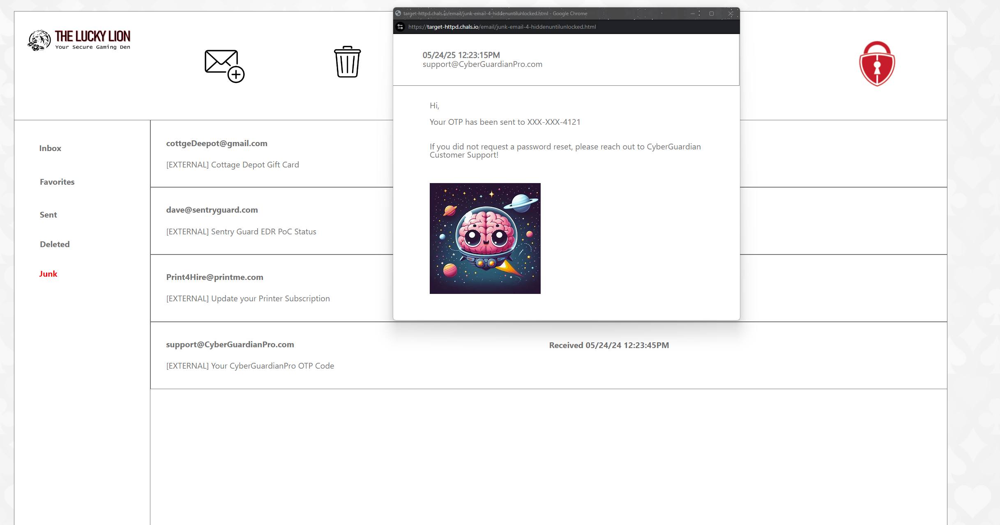

# O5: Take Over an EDR Account

## Problem Description
Now that you know the EDR tool in use, you've discovered that the best way to take over assets inside of The Lucky Lion is to gain access to the console of the EDR tool. Given the high-privileged rights that EDR Services run as, getting access to this tool should provide unfettered access to The Lucky Lion's resources!

After taking over the email account utilizing their quished credentials, you learned that the administrator is using a different password for accessing the EDR console. (Yay!) However, you've discovered the Java application that The Lucky Lion is utilizing for OTP and you've zipped it up as Alg_Gen.zip (attached in Files). After dissecting the application, it seems to be a promising (albeit disheartening) path!

To get into the EDR console, you'll need to figure out how to take over the credentials for The Lucky Lion's EDR administrator. How can we go about obtaining the credentials for this user?

## Objective
Provide the One-Time Password from the vendor to reset the user's password.

Provided: [alg_gen.zip](resources/alg_gen.zip)

## Approach and Solution
Time for some good ol' static analysis!

As a general rule, whenever I am provided the source code for a challenge, I go through it and perform some basic static analysis. Usually, this is along the lines of:
1) What is this program meant to do?
2) How is it accomplishing that objective? What methods, libraries, or tools is the program using?
3) What are some possible vulnerabilities? What can we do with those vulnerabilities?

This challenge doesn't require us to go quite so in-depth, but reading and understanding code quickly definitely is very helpful.

First, when we unzip the alg_gen file, we see that there are three different folders: `__MACOSX`, `.gradle`, and `alg_gen`. `alg_gen` will contain the source code, so that is all we need to look at for now. Within the `alg_gen` folder, there is another folder called `src`. That's where all the source code for this application is located. Going a little further into `src/main/java`, we See `Controllers`, `Helpers`, `Models`, and `Services`. Typically, controllers handle backend algorithm stuff--exactly what we want.

Indeed, inside `Controllers`, we see a `GeneratorController.java` file, which contains a function `generate_token` and a mapping to a `/generate` URL. 

```java
@GetMapping("/generate")
public String generate_token(
    @RequestParam(value = "email", required = true) String email) {

    return tokenGeneratorService.generate_token();
}

@PostMapping("validate")
public Boolean verify_token() {

    return true;
}
```
This function calls another function: `tokenGeneratorService.generate_token()`. Looking under the `Services` Folder, we see a file called `TokenGeneratorService.java`. This contains the basic algorithm for generating the token:

```java
public class TokenGeneratorService {

    public String generate_token() {
        return General_Helpers.getTimestamp().replaceAll("[-: ]", "").substring(6,12);
    }
}
```

Nice!

From just reading this code, we can tell that the token is generated by taking the current timestamp, removing any non-numeric characters, and then taking the six digits between index 6 and 12 as the token. Easy enough. We just need to know one more thing: how exactly is the current timestamp formatted?

Well, the `generate_token()` function here actually calls another function: `General_Helpers.getTimestamp()`. Looking under `Helpers`, we find `General_Helpers.java`, which contains the `getTimestamp()` function. This function returns the `simpleDateFormat` of the current date. Luckily, we also get a definition of the `simpleDateFormat`:

`final SimpleDateFormat simpleDateFormat = new SimpleDateFormat("MM/dd/yyyy HH:mm a z");`

which gives us our timestamp format.

An arbitrary date, then, would be formatted as "01/01/70 01:23:45AM", and the corresponding token would be 700123.
We just write a simple script in Python to accomplish this.

```python
def get_timestamp():
    return datetime.now().strftime("%m/%d/%y %I:%M:%S%p")

def generate_token():
    timestamp = get_timestamp()
    cleaned_timestamp = timestamp.replace("-", "").replace(":", "").replace(" ", "")
    otp = cleaned_timestamp[6:12]
    return otp

if __name__ == "__main__":
    token = generate_token()
    print(f"Generated OTP: {token}")
```

But when we submit the token generated from here, it fails. Uh oh! Turns out that we need to generate this token from a *specific* date and time. What date and time? Well, let's do a little recon.

From the instructions earlier, there was this sentence: "After taking over the email account utilizing their quished credentials, you learned that the administrator is using a different password for accessing the EDR console." So perhaps there might be a clue hiding in the email account?

After a little while of searching...yes! We find it!

Inside the Junk folder, there is an email from CyberGuardianPro about an OTP code. We simply rip the timestamp from that email (05/24/24 12:23:45PM) and put it through our script.

This gives us `241223` as the OTP.