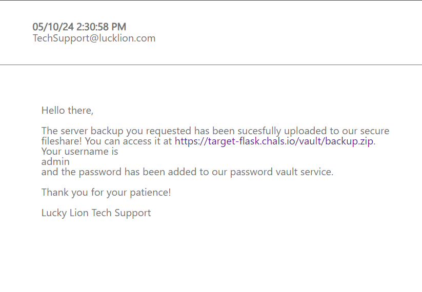

# O8: Performing an Exfil of a Filesystem

## Problem Description
You have a solid foothold in The Lucky Lion's environment - now it's time to start poking around. Looking through more of the emails from the account you compromised, you see something interesting: a backup of a server was recently uploaded to a secure fileshare. You wager there could be some valuable information to sell if you can get those files, but the backup is password protected.

To get you started, we've provided you with the host & port where we've noticed a password vault service running. You can connect to it with Netcat (nc) as shown at the bottom.

## Objectives
- Find a way to extract passwords from the vault so you can download the ZIP
- Once you obtain the ZIP, find a way to break the encryption scheme and find the flag file within

Host and port: `nc 0.cloud.chals.io 18529`

[ValuVault Documentation](resources/ValuVaultDocs.html)

## Approach and Solution

### Part 1: Downloading the ZIP File
The first thing we have to do is find that email. Luckily, it's quick work, and directly in the webmail inbox.



We can click on that [link](https://target-flask.chals.io/vault/backup.zip) to try to download the `backup.zip` file. Unfortunately, it requires a username and password to download. We have the username already from the email--`admin`. The password, however, is much trickier.

Running the provided `nc` command gets us into a server with just four commands. Running some of the basic commands yields the following:


Not exactly the most useful thing ever. However, we can look at the very helpful [documentation](resources/ValuVaultDocs.html) provided to us! There is a bunch of stuff here, but most notably, it looks like we can set MOTD with a variable called `{now}`. 

Experimenting in the server shows that we can access any property of the object `now`, but no other objects (trust me, I tried). For example, we can run `MOTD {now.__dict__}`. For those unfamiliar with Python, it means that we can now access dunder (or magic) methods through the `{now}` object. This is huge, because now we have access to a whole lot of new information--including information that might tell us about how the `{now}` object interacts with the rest of the environment. Specifically, running `MOTD {now.__class__.__dict__}` show that there is an `__init__` function, which suddenly opens up a whole new world of possibilities. It verifies the existence of the `__init__` dunder method for this object and also lets us explore much more of the object.

Here is kind of where I just took a bunch of time exploring and figuring out all the different things I could access with this read access. I tried probably a million different commands in different spaces, mostly just to learn about sandboxing in Python, essentially. It wasn't exactly necessary for the challenge, but it is where I spent the majority of my time. A recommendation for anyone doing CTFs: if you have the time to do so, explore your environments! You can learn a lot in unexpected places.

The important part of this is that accessing the `init` function means that we can access the `globals` as well. So we run:

`MOTD {now.__init__.__globals__}`

and get...


...which contains the master password: `Li0n_a83*kFYz95!2`

Amazing! Now we can just use that master password to get all the other available passwords.

- test: `hunter2`
- backup_admin: `8szS)89Y$jDq0t}BS:Hj<37J`
- slots_admin: `/D~Yl9I*966aI:F0A]4NL7/L`

Now we go back to the site where we need to download our zip file, and enter our credentials. The zip file is downloaded successfully!

But the challenge isn't over yet...

### Part 2: Decrypting the ZIP File
Turns out the zip file that we downloaded was encrypted. So we need to decrypt it in order to get the flag inside it.

As with any decryption challenge, you must first understand the encryption scheme in order to reverse and decrypt it.

First, I run a 7zip analysis on the zip file with `7z l -slt backup.zip`. This returns a lot of stuff, but here is the relevant part:

```
Path = flag.txt
Folder = -
Size = 40
Packed Size = 52
Modified = 2024-07-10 13:02:44
Created = 
Accessed = 
Attributes =  -rw-r--r--
Encrypted = +
Comment = 
CRC = 6E9BC533
Method = ZipCrypto Store
Characteristics = UT:MA:1 ux : Encrypt Descriptor
Host OS = Unix
Version = 10
Volume Index = 0
Offset = 127

Path = slots.txt
Folder = -
Size = 1228
Packed Size = 1240
Modified = 2024-07-10 11:38:03
Created = 
Accessed = 
Attributes =  -rw-r--r--
Encrypted = +
Comment = 
CRC = 701575D6
Method = ZipCrypto Store
Characteristics = UT:MA:1 ux : Encrypt Descriptor
Host OS = Unix
Version = 10
Volume Index = 0
Offset = 389
```

Immediately, we see the method used to encrypt both of these files and likely the entire zip: ZipCrypto Store. A quick Google search reveals another name for the encryption (PKWARE) and a corresponding plaintext attack. This is exactly what we're looking for.

From here, we discover a tool specifically made to perform this plaintext attack on zip files encrypted via ZipCrypto: [`bkcrack`](https://github.com/kimci86/bkcrack). I just built it from source, but you can use the binaries if you like.

Looking deeper into the vulnerability, we learn that it is a plaintext attack where, if you have part of the encrypted file in plaintext, the tool can force the rest. This is due to the way the encryption algorithm works--a pseudo-random stream of bytes is XOR'ed to the plaintext to produce ciphertext. The pseudo-random generator is initialized with the password and then updated with the plaintext as encryption goes on. TLDR; another XOR vulnerability coupled with bad randomness.

So now, knowing all of this, what we need to do is to find some plaintext. From the tool description, we know that we need a minimum of 12 bytes, 8 of which must be sequential. There are two files in the zip file that have data: `slots.txt` and `flag.txt`. It's unlikely that we'll be able to guess exactly what is in the `flag.txt` file, so I want to focus on the `slots.txt` file first.

A couple of notes about finding plaintext bytes:
1) If you have encrypted data in different file formats, such as PNGs or PDFs, you can take advantage of magic headers.
2) Other filetypes, such as XML, typically have opening declarations. In the case of XML, that is typically something like `<?xml version="1.0" encoding="UTF-8"?>`.
3) You can use the CRC to force an extra byte or two. This is very useful in cases where you are one or two bytes short.

In our case though, none of this is particularly helpful due to the files being in .txt format, which is pretty notorious for having zero filler. Given that the usual techniques I might apply to solve such a problem won't work, I need to turn to other methods.

This is about when I started scouring back through the challenge, remembering that the webserver had a slots_admin password on it. And...there is a slots.txt file inside the encrypted zip. So perhaps if I could get that slots.txt file by using the slot_admin password, that might work?

Looking back at the URL that was given to us to download the zip, `https://target-flask.chals.io/vault/backup.zip`, I notice that backup.zip is actually located within another folder called `vault`, which seemingly specifically serves files. What if I simply modify the URL to become `https://target-flask.chals.io/vault/slots.txt`?

This is indeed the correct approach. Doing so gets me another password protected file, on which I can use the slots_admin password that I found on the server. This gives me the plaintext for `slots.txt`!

Now all I have to do is run my command:

`./bkcrack -C ~/grasshopper/workbench/backup.zip -c slots.txt -p ~/grasshopper/workbench/slots.txt -D ~/grasshopper/workbench/decrypted.zip`

This decrypts `backup.zip` into `decrypted.zip` in my preferred local working directory. Now I can simply open it up and read the flag from `flag.txt`.

`flag{xamine_your_zip_pretty_darn_quick}`