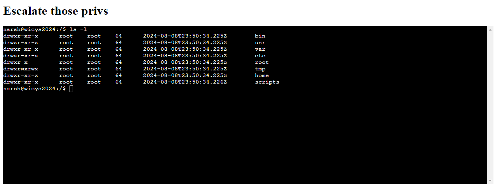
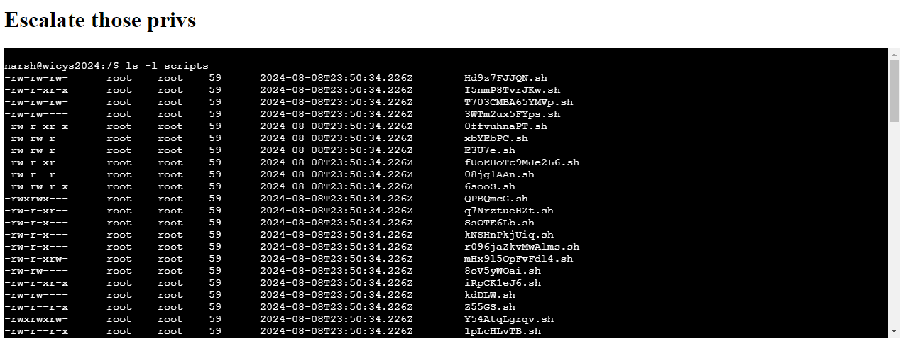

# O9: Escalate Your Privileges

## Problem Description
Things are going well - you've gained initial access to another host on The Lucky Lion's network, but you have limited access with your current privileges. Let's open up a terminal and see if you can change that.

One of the easiest ways to run a command that you don't have permission to execute is to find a file that DOES have the right permissions and have it execute your command for you, all you have to do is find the right file!

## Objective
Using the NARSH (Not A Real Shell) emulator, find a file with world writable permissions that executes as root.

Web Shell: https://target-httpd.chals.io/shell/privesc.html

## Approach and Solution
We are back in that dang limited environment again. Luckily for us, it is much more straightforward this time. It's simply a matter of exploration.

We can recall and subsequently assume that our permissions in this shell are the same as last time (in other words, nada). So it is unlikely that we are going to use commands like `chmod` or anything else that requires elevated privileges.

For this problem, then, we can pretty much just assume that the answer lies in exploration. Fortunately, we do have `ls -l` available for us to use. Running this command gives us this:



So we have lots of directories we need to get through...

From the root directory, I just use `ls -l` on pretty much every directory sequentially. There is a scripts folder that looks particularly promising, so let's try running `ls -l` on that.



That's a lot of scripts! However, notice that none of them have global rwx permissions. Even if one of these scripts were the correct answer, we wouldn't be able to tell which one. Our princess is in a different castle.

Now that the juicy red herring is out of the way, we begin the slow work of trawling through every directory. The basic workflow is this:
- If it is a directory, use `ls-l` on it and go further in if anything exists.
- If it is a `.sh` file, check its permissions. If it is not global rwx, move on.
- If it is a file but NOT a `.sh` file, use the `cat` command to read it.

Using this method, we happen upon quite a deep directory: `/var/spool/cron/crontabs`, inside of which has two files: `narsh` and `root`. This is very exciting because we know that we are the narsh user, and thus that other file must refer to the root user.

Using the command `cat root`, we get the following file:

```
# Edit this file to introduce tasks to be run by cron.
# 
# Each task to run has to be defined through a single line
# indicating with different fields when the task will be run
# and what command to run for the task
# 
# To define the time you can provide concrete values for
# minute (m), hour (h), day of month (dom), month (mon),
# and day of week (dow) or use '*' in these fields (for 'any').
# 
# Notice that tasks will be started based on the cron's system
# daemon's notion of time and timezones.
# 
# Output of the crontab jobs (including errors) is sent through
# email to the user the crontab file belongs to (unless redirected).
# 
# For example, you can run a backup of all your user accounts
# at 5 a.m every week with:
# 0 5 * * 1 tar -zcf /var/backups/home.tgz /home/
# 
# For more information see the manual pages of crontab(5) and cron(8)
# 
# m h  dom mon dow   command
2 0 * * * root /scripts/yydUpQ.sh
```

Now it's clear from this file that the file we are looking for with the correct permissions is `yydUpQ.sh`.

We submit the file name as our flag, and bingo! It is correct!